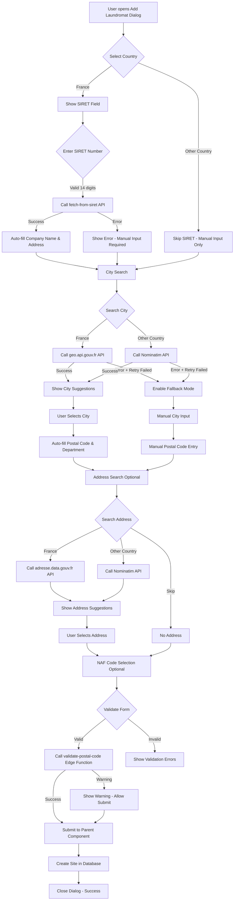
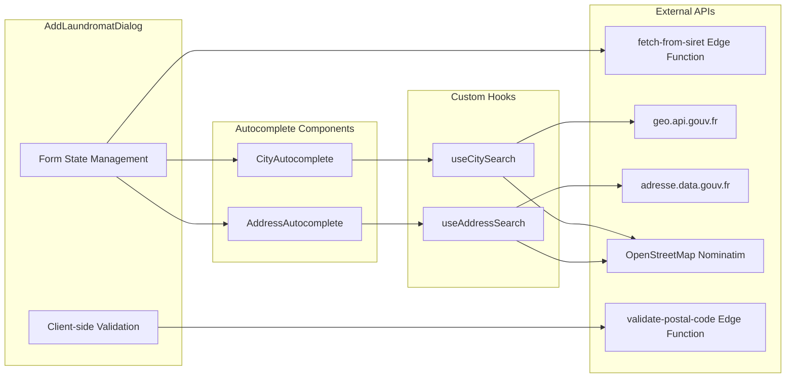

# Add Laundromat Dialog - Flow Documentation

This document describes the user flow and logic of the **AddLaundromatDialog** component used to create new laundromat sites.

## Overview

The dialog allows users to add a new laundromat with automatic data filling capabilities (SIRET lookup for French businesses) and fallback manual input modes.

## Flow Diagram

## Component Architecture

## Key Features

### 1. SIRET Auto-fill (France Only)
- User enters a 14-digit SIRET number
- System calls the `fetch-from-siret` edge function
- On success: Company name and address are auto-filled
- On failure: User must enter data manually

### 2. City Search with Fallback
- Primary: Uses government APIs (geo.api.gouv.fr for France)
- Retry mechanism: Automatic retry on first failure
- Fallback: Manual input mode with "Retry" button if API unavailable

### 3. Address Autocomplete
- Optional field
- Uses adresse.data.gouv.fr for France
- Uses Nominatim for other countries

### 4. Postal Code Validation
- Client-side validation for format
- Server-side validation via edge function for France
- Auto-derives department code from postal code

### 5. Country Support
- France (full features: SIRET, specialized APIs)
- Belgium, Netherlands, Germany, Spain, Italy (Nominatim-based search)

## Form Fields

| Field | Required | Auto-fill Source |
|-------|----------|------------------|
| SIRET | No (FR only) | User input |
| Laundromat Name | Yes | SIRET API |
| Country | Yes | User selection |
| City | Yes | City search API |
| Postal Code | Yes | City selection |
| Department | No (FR only) | Derived from postal code |
| Address | No | Address search API or SIRET |
| NAF Code | No (FR only) | User selection |

## Error Handling

1. **API Failures**: Graceful degradation to manual input
2. **Network Issues**: Retry mechanism with user feedback
3. **Validation Errors**: Inline error messages per field
4. **Server Validation**: Warning dialogs for postal code mismatches

## Related Files

- `src/components/laundromat/AddLaundromatDialog.tsx` - Main dialog component
- `src/components/laundromat/CityAutocomplete.tsx` - City search component
- `src/components/laundromat/AddressAutocomplete.tsx` - Address search component
- `src/hooks/useCitySearch.ts` - City search hook
- `src/hooks/useAddressSearch.ts` - Address search hook
- `supabase/functions/fetch-from-siret/index.ts` - SIRET lookup edge function
- `supabase/functions/validate-postal-code/index.ts` - Postal code validation
