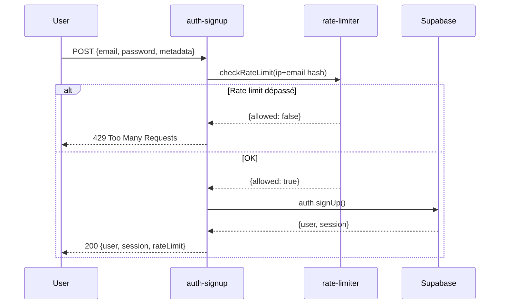
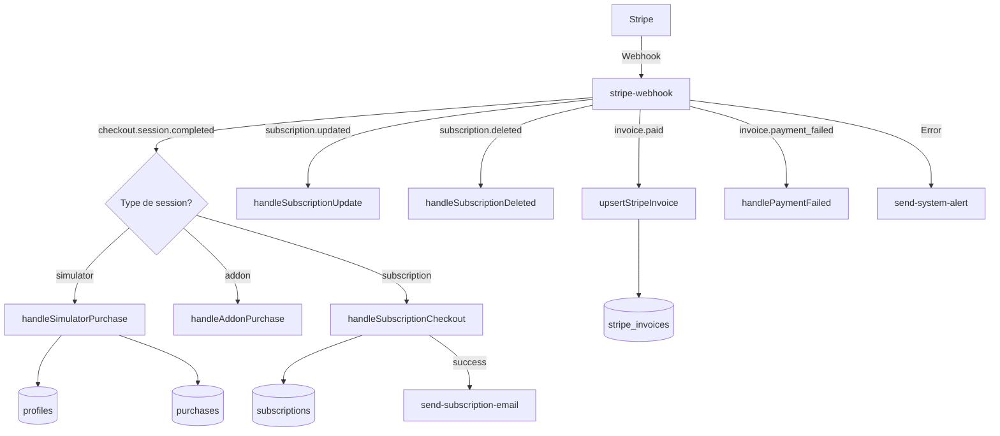
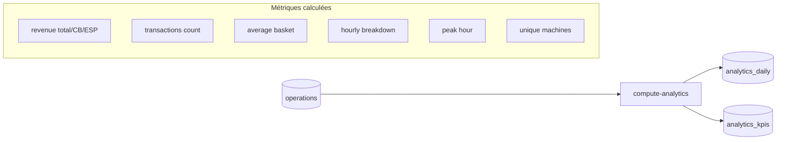
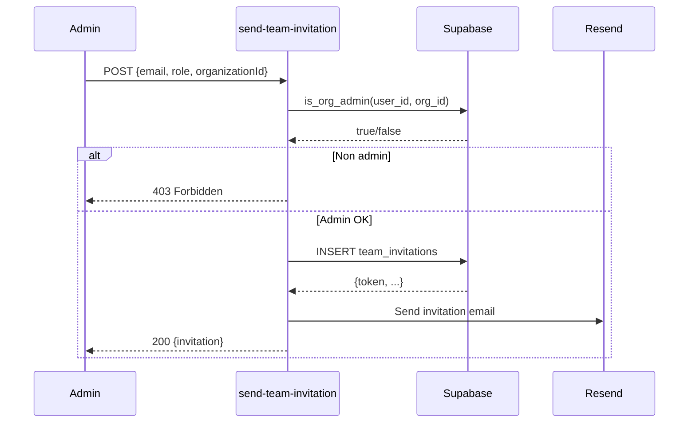
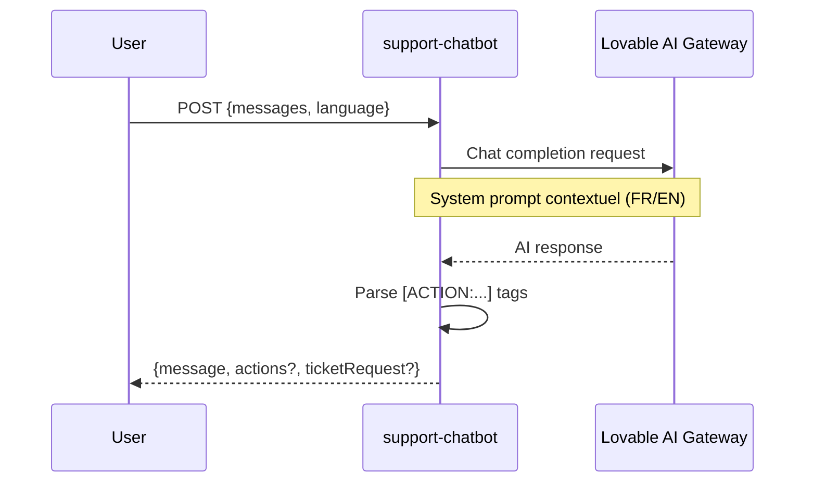
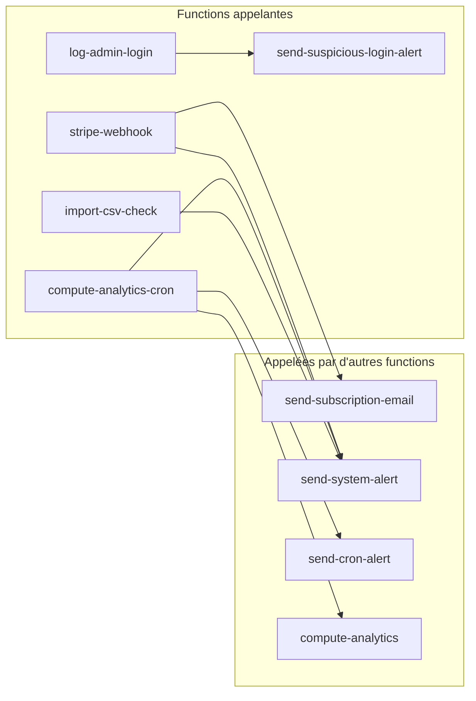

# Edge Functions Architecture

Documentation complète des edge functions du projet Lavcom Performances avec leurs dépendances et flux de données.

## Vue d'ensemble

```mermaid
graph TB
    subgraph "Frontend React"
        APP[Application Web]
    end
    
    subgraph "Edge Functions - Authentication"
        AUTH_SIGNUP[auth-signup]
        LOG_LOGIN[log-login]
        LOG_ADMIN_LOGIN[log-admin-login]
        CLEANUP[cleanup-login-logs]
    end
    
    subgraph "Edge Functions - Payment & Billing"
        STRIPE_WH[stripe-webhook]
        CREATE_SUB[create-subscription-checkout]
        CREATE_SIM[create-simulator-checkout]
        CREATE_ADDON[create-addon-checkout]
        CUSTOMER_PORTAL[customer-portal]
        LIST_INVOICES[list-invoices]
    end
    
    subgraph "Edge Functions - Analytics"
        COMPUTE[compute-analytics]
        COMPUTE_CRON[compute-analytics-cron]
    end
    
    subgraph "Edge Functions - Team Management"
        SEND_INVITE[send-team-invitation]
        ACCEPT_INVITE[accept-invitation]
        VALIDATE_INVITE[validate-invitation]
        SEND_ADMIN_INVITE[send-admin-invitation]
    end
    
    subgraph "Edge Functions - Notifications"
        TRIAL_REMINDER[trial-reminder]
        SEND_SUB_EMAIL[send-subscription-email]
        CHECK_CHURN[check-churn-alert]
        SEND_CRON_ALERT[send-cron-alert]
        SEND_SYSTEM_ALERT[send-system-alert]
        SEND_PERMISSION[send-permission-alert]
        SEND_SUSPICIOUS[send-suspicious-login-alert]
    end
    
    subgraph "Edge Functions - User Features"
        SUPPORT_CHAT[support-chatbot]
        SEND_CONTACT[send-contact]
        SUBMIT_EXPERT[submit-expert-request]
        CREATE_DEMO[create-demo]
        IMPORT_CHECK[import-csv-check]
    end
    
    subgraph "Edge Functions - Utilities"
        FETCH_SIRET[fetch-from-siret]
        VALIDATE_POSTAL[validate-postal-code]
        CSP_REPORT[csp-report]
        CHECK_WEBHOOK[check-webhook-status]
        SMOKE_TESTS[smoke-tests-cron]
    end
    
    subgraph "Services Externes"
        STRIPE[Stripe API]
        RESEND[Resend Email]
        SIRENE[API SIRENE]
        LOVABLE_AI[Lovable AI Gateway]
        SLACK[Slack Webhooks]
    end
    
    subgraph "Database"
        SUPABASE[(Supabase PostgreSQL)]
    end
    
    APP --> AUTH_SIGNUP
    APP --> LOG_LOGIN
    APP --> CREATE_SUB
    APP --> SUPPORT_CHAT
    APP --> SEND_CONTACT
    APP --> IMPORT_CHECK
    
    STRIPE --> STRIPE_WH
    STRIPE_WH --> SEND_SUB_EMAIL
    
    COMPUTE_CRON --> COMPUTE
    COMPUTE_CRON --> SEND_CRON_ALERT
    
    SEND_INVITE --> RESEND
    TRIAL_REMINDER --> RESEND
    CHECK_CHURN --> RESEND
    SEND_CRON_ALERT --> RESEND
    SEND_CRON_ALERT --> SLACK
    
    SUPPORT_CHAT --> LOVABLE_AI
    FETCH_SIRET --> SIRENE
    
    AUTH_SIGNUP --> SUPABASE
    COMPUTE --> SUPABASE
    CREATE_SUB --> STRIPE
```



---

## Catégories de Functions

### 🔐 Authentication & Security

#### `auth-signup`
**But:** Inscription sécurisée avec rate limiting

| Aspect | Détails |
|--------|---------|
| **Trigger** | POST depuis le formulaire d'inscription |
| **Auth** | `verify_jwt = false` |
| **Rate Limit** | 5 tentatives/heure (IP + email combinés) |
| **Dépendances** | `_shared/rate-limiter.ts` |



#### `log-login`
**But:** Journalisation des connexions avec détection de nouveaux appareils

| Aspect | Détails |
|--------|---------|
| **Trigger** | Appelé après SIGNED_IN via useLoginLogger |
| **Auth** | `verify_jwt = true` |
| **Tables** | `login_logs` |

**Flux de données:**
- Input: `{user_agent, browser, os, device_type, device_hash}`
- Détecte si c'est un nouvel appareil
- Output: `{is_new_device: boolean}`

#### `log-admin-login`
**But:** Journalisation des connexions admin avec détection de connexions suspectes

| Aspect | Détails |
|--------|---------|
| **Auth** | `verify_jwt = true` |
| **Tables** | `admin_login_history`, `admin_trusted_ips` |
| **Appelle** | `send-suspicious-login-alert` si suspect |

#### `cleanup-login-logs`
**But:** Nettoyage CRON des anciens logs de connexion

| Aspect | Détails |
|--------|---------|
| **Trigger** | CRON job |
| **Auth** | `verify_jwt = false` |
| **Tables** | `profiles`, `login_logs` |

---

### 💳 Payment & Billing (Stripe)

#### `stripe-webhook`
**But:** Handler central des événements Stripe

| Aspect | Détails |
|--------|---------|
| **Trigger** | Webhook Stripe |
| **Auth** | `verify_jwt = false` (signature Stripe) |
| **Events traités** | `checkout.session.completed`, `customer.subscription.*`, `invoice.*` |



**Tables modifiées:**
- `profiles` (access_expires_at, max_projects, plan_code)
- `purchases` (achats one-time simulateur)
- `subscriptions` (abonnements)
- `stripe_invoices` (factures)
- `stripe_events` (idempotence)

#### `create-subscription-checkout`
**But:** Création de session Stripe pour abonnement

| Aspect | Détails |
|--------|---------|
| **Auth** | `verify_jwt = true` |
| **Input** | `{price_id?, plan?, laundryCount, success_url, cancel_url}` |
| **Output** | `{url: string}` (redirect Stripe) |

**Allowlist des prix:**
- Tier 1 (1-2 laveries): mensuel/annuel
- Tier 2 (3-5 laveries): mensuel/annuel  
- Tier 3 (6+ laveries): mensuel/annuel

#### `create-simulator-checkout`
**But:** Achat one-time du simulateur

| Aspect | Détails |
|--------|---------|
| **Auth** | `verify_jwt = true` |
| **Packs** | essential (79€), project (149€), comparator (229€), premium (279€) |

#### `create-addon-checkout`
**But:** Achat d'add-ons (extension 30j, +1 projet)

| Aspect | Détails |
|--------|---------|
| **Auth** | `verify_jwt = true` |
| **Add-ons** | `extension_30d`, `project_plus1` |

#### `customer-portal`
**But:** Redirection vers le portail client Stripe

#### `list-invoices`
**But:** Liste des factures payées de l'utilisateur

---

### 📊 Analytics

#### `compute-analytics`
**But:** Calcul des KPIs journaliers et mensuels pour un site

| Aspect | Détails |
|--------|---------|
| **Auth** | `verify_jwt = true` |
| **Input** | `{site_id, user_id, start_date, end_date}` |
| **Tables lues** | `operations` |
| **Tables écrites** | `analytics_daily`, `analytics_kpis` |



#### `compute-analytics-cron`
**But:** CRON job qui déclenche le calcul pour tous les sites actifs

| Aspect | Détails |
|--------|---------|
| **Auth** | `verify_jwt = false` + `x-cron-secret` header |
| **Rate Limit** | IP-based |
| **Tables** | `operations` (lecture), `cron_logs` (écriture) |
| **Appelle** | `compute-analytics` pour chaque site, `send-cron-alert` en cas d'échecs |

**Flux:**
1. Vérifie le secret CRON
2. Récupère les sites avec opérations récentes (30 jours)
3. Appelle `compute-analytics` pour chaque site (90 jours)
4. Log le résultat dans `cron_logs`
5. Envoie alerte si échecs consécutifs

---

### 👥 Team Management

#### `send-team-invitation`
**But:** Envoi d'invitation à rejoindre une organisation

| Aspect | Détails |
|--------|---------|
| **Auth** | `verify_jwt = true` |
| **Permissions** | Doit être admin de l'organisation |
| **Tables** | `team_invitations`, `organizations`, `profiles` |
| **Email** | Via Resend |



#### `accept-invitation`
**But:** Acceptation d'une invitation

| Aspect | Détails |
|--------|---------|
| **Auth** | `verify_jwt = true` |
| **Validations** | Token valide, non expiré, email correspond |
| **Tables** | `team_invitations`, `user_roles` |

#### `validate-invitation`
**But:** Validation d'un token d'invitation (sans acceptation)

| Aspect | Détails |
|--------|---------|
| **Auth** | `verify_jwt = false` |
| **Output** | Status de l'invitation (valid, expired, already_accepted, not_found) |

#### `send-admin-invitation`
**But:** Invitation d'un admin plateforme

---

### 📧 Notifications & Alerts

#### `send-subscription-email`
**But:** Emails transactionnels liés aux abonnements

| Aspect | Détails |
|--------|---------|
| **Auth** | `verify_jwt = false` |
| **Types** | activation, renewal, payment_failed, cancellation |
| **Service** | Resend |

#### `trial-reminder`
**But:** Rappel avant fin d'essai (J-3)

| Aspect | Détails |
|--------|---------|
| **Trigger** | CRON job |
| **Cible** | Utilisateurs avec trial expirant dans 3 jours |
| **Tables** | `subscriptions`, `profiles` |

#### `check-churn-alert`
**But:** Alerte si churn mensuel dépasse le seuil

| Aspect | Détails |
|--------|---------|
| **Tables** | `churn_alert_settings`, `subscriptions` |
| **Cooldown** | Configurable (default 24h) |

#### `send-cron-alert`
**But:** Alertes pour échecs de CRON jobs

| Aspect | Détails |
|--------|---------|
| **Canaux** | Email (Resend) + Slack (Webhook) |
| **Severités** | warning, critical |

#### `send-system-alert`
**But:** Alertes système génériques

#### `send-permission-alert`
**But:** Alertes sur modifications de permissions

#### `send-suspicious-login-alert`
**But:** Alertes connexions suspectes admin

---

### 🛠 User Features

#### `support-chatbot`
**But:** Chatbot IA d'aide contextuelle

| Aspect | Détails |
|--------|---------|
| **Auth** | `verify_jwt = false` |
| **AI** | Lovable AI Gateway (gemini-2.5-flash) |
| **Langues** | FR, EN |



#### `send-contact`
**But:** Formulaire de contact avec protection anti-spam

| Aspect | Détails |
|--------|---------|
| **Auth** | `verify_jwt = false` |
| **Protections** | Honeypot, rate limit (IP + email), déduplication |
| **Tables** | `contact_messages`, `rate_limits` |
| **Email** | Admin + confirmation utilisateur |

#### `submit-expert-request`
**But:** Demande de contact expert

| Aspect | Détails |
|--------|---------|
| **Types** | installation, management, communication, insurance |
| **Tables** | `expert_requests` |

#### `create-demo`
**But:** Création d'un site de démonstration avec données fictives

| Aspect | Détails |
|--------|---------|
| **Auth** | `verify_jwt = true` |
| **Rate Limit** | 1 par 24h par utilisateur |
| **Données** | 6 mois d'opérations simulées |

```mermaid
flowchart TD
    USER[Utilisateur] --> CHECK{Demo existe?}
    CHECK -->|Oui| RETURN[Retourne siteId existant]
    CHECK -->|Non| CREATE[Créer site demo]
    CREATE --> BATCH[Créer import_batch]
    BATCH --> GENERATE[Générer opérations]
    GENERATE --> INSERT[Insert operations x1000]
    INSERT --> DONE[Retourne {siteId, count}]
    
    subgraph "Données générées"
        MACHINES[8 machines]
        PROGRAMS[8 programmes]
        PAYMENTS[4 modes paiement]
        TEMPORAL[Patterns horaires/jours/mois]
    end
```

#### `import-csv-check`
**But:** Vérification des droits et rate limits avant import CSV

| Aspect | Détails |
|--------|---------|
| **Auth** | `verify_jwt = true` |
| **Rate Limits** | 1/2min par site, 10/h par utilisateur |

---

### 🔧 Utilities

#### `fetch-from-siret`
**But:** Récupération des informations entreprise via SIRET

| Aspect | Détails |
|--------|---------|
| **Auth** | `verify_jwt = false` |
| **API externe** | entreprise.data.gouv.fr (SIRENE v3) |
| **Rate Limit** | Via _shared/rate-limiter |

**Output:**
```typescript
interface SiretResponse {
  company_name: string;
  trade_name: string | null;
  address_line1: string;
  postal_code: string;
  city: string;
  naf_code: string;
}
```

#### `validate-postal-code`
**But:** Validation des codes postaux multi-pays

| Aspect | Détails |
|--------|---------|
| **Pays supportés** | FR, BE, CH, LU, DE, IT, NL, ES, AT, PT |
| **France** | Dérive le code département (y compris Corse et DOM-TOM) |

#### `csp-report`
**But:** Réception des rapports CSP (Content Security Policy)

| Aspect | Détails |
|--------|---------|
| **Input** | `application/csp-report` |
| **Output** | 204 No Content (toujours) |
| **Action** | Log pour monitoring |

#### `check-webhook-status`
**But:** Vérifie la réception des webhooks Stripe

| Aspect | Détails |
|--------|---------|
| **Tables** | `stripe_events`, `cron_alert_settings` |
| **Seuil** | 24h sans événement = alerte |

#### `smoke-tests-cron`
**But:** Tests de santé automatiques

---

## Module Partagé

### `_shared/rate-limiter.ts`

Module de rate limiting utilisé par plusieurs edge functions.

```typescript
// Configuration des limites
const RATE_LIMITS = {
  'auth/signup': { maxRequests: 5, windowSeconds: 3600 },
  'contact/ip': { maxRequests: 5, windowSeconds: 600 },
  'contact/email': { maxRequests: 3, windowSeconds: 600 },
  'edge/create-demo': { maxRequests: 1, windowSeconds: 86400 },
  'edge/fetch-from-siret': { maxRequests: 20, windowSeconds: 60 },
  'import/csv-site': { maxRequests: 1, windowSeconds: 120 },
  'import/csv-user': { maxRequests: 10, windowSeconds: 3600 },
  // ...
};

// Fonctions exportées
export async function checkRateLimit(...): Promise<RateLimitResult>;
export async function hashIP(ip: string): Promise<string>;
export function maskEmail(email: string): string;
export function rateLimitResponse(...): Response;
```

**Fonctionnalités:**
- Hash IP pour privacy (SHA-256)
- Masquage email dans les logs
- Cooldown avec retry-after
- Persistance dans table `rate_limits`

---

## Configuration (supabase/config.toml)

| Function | verify_jwt |
|----------|------------|
| auth-signup | false |
| stripe-webhook | false |
| send-contact | false |
| fetch-from-siret | false |
| csp-report | false |
| trial-reminder | false |
| check-churn-alert | false |
| send-subscription-email | false |
| validate-invitation | false |
| support-chatbot | false |
| **Autres** | **true** |

---

## Variables d'environnement requises

| Variable | Functions utilisant |
|----------|-------------------|
| `SUPABASE_URL` | Toutes |
| `SUPABASE_SERVICE_ROLE_KEY` | Toutes (service role) |
| `SUPABASE_ANON_KEY` | auth-signup, stripe-webhook |
| `STRIPE_SECRET_KEY` | stripe-*, create-*-checkout |
| `STRIPE_WEBHOOK_SECRET` | stripe-webhook |
| `RESEND_API_KEY` | send-*, trial-reminder, check-churn-alert |
| `RESEND_FROM_EMAIL` | send-* |
| `RESEND_TO_EMAIL` | send-contact, submit-expert-request |
| `SLACK_WEBHOOK_URL` | send-cron-alert |
| `LOVABLE_API_KEY` | support-chatbot |
| `CRON_SECRET` | compute-analytics-cron |
| `SITE_URL` | send-team-invitation |

---

## Diagramme des dépendances inter-functions



---

## Tables principales utilisées

| Table | Functions |
|-------|-----------|
| `profiles` | auth-signup, trial-reminder, stripe-webhook |
| `subscriptions` | trial-reminder, check-churn-alert, stripe-webhook |
| `operations` | compute-analytics, create-demo |
| `analytics_daily` | compute-analytics |
| `analytics_kpis` | compute-analytics |
| `sites` | import-csv-check, create-demo |
| `team_invitations` | send-team-invitation, accept-invitation, validate-invitation |
| `user_roles` | accept-invitation |
| `organizations` | send-team-invitation, accept-invitation |
| `login_logs` | log-login, cleanup-login-logs |
| `admin_login_history` | log-admin-login |
| `rate_limits` | _shared/rate-limiter |
| `cron_logs` | compute-analytics-cron |
| `contact_messages` | send-contact |
| `expert_requests` | submit-expert-request |
| `stripe_events` | stripe-webhook, check-webhook-status |
| `stripe_invoices` | stripe-webhook |
| `purchases` | stripe-webhook |
| `system_events` | via rpc_log_system_event |
