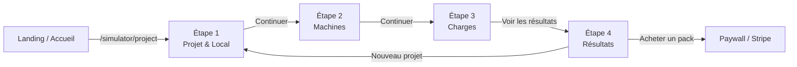
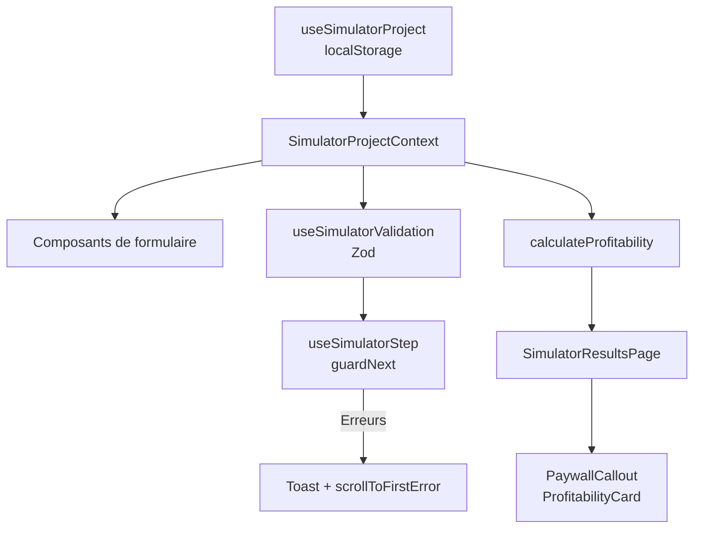

# Onboarding — New Profitability Simulator

> Version française : [docs/simulateur-v2-onboarding.md](../simulateur-v2-onboarding.md)

> Document intended for developers joining the project. It describes what has been implemented since the creation of the new profitability simulator, its architecture, its main conventions, and points of attention for contributing to it without breaking existing user journeys.

---

## 1. Context and scope

### 1.1 Why a new simulator?

The Lavcom Performances application has two historical simulator journeys (parcours):

- `/simulateur` — **free public** qualification simulator, with email capture.
- `/simulation` — **paid simulator integrated into the SaaS**, with authentication, Stripe packs and database persistence.

The **new simulator** (`/simulator/*`) is a redesign of the paid journey. Its long-term goal is to **replace both legacy simulators** with a more modern, unified experience that is easier to maintain. The old code is kept while the new one is developed, so as not to impact production users.

> **Warning**: once the new simulator is delivered, a cleanup phase will be needed to remove obsolete components, pages, hooks and routes (`/simulateur`, `/simulation`) and fix the application's links to keep only the new simulator, without breaking the rest of the application.

### 1.2 Current scope of this document

| Journey (parcours) | URL | Status |
|---|---|---|
| New visitor simulator | `/simulator/*` | Under development, functional without authentication, localStorage only. |
| Project owner (porteur de projet) dashboard | `/dashboard-simulator/*` | **Draft prototype (prototype brouillon)** generated by Lovable AI from Figma mockups. Mocked data, non-functional. See section 8 and `docs/simulateur-v2-roadmap.md`. |
| Legacy public simulator | `/simulateur` | Kept in production, not documented here. See `docs/simulateur-rentabilite.md`. |
| Legacy SaaS simulator | `/simulation` | Kept in production, not documented here. See `docs/simulateur-architecture.md`. |

---

## 2. Route map

Routes are defined in `src/App.tsx`. Two distinct groups are declared:

### 2.1 Visitor simulator

```
/simulator              → redirect to /simulator/project
/simulator/project      → Step 1: project identity + local (premises) constraints
/simulator/machines     → Step 2: machine configuration
/simulator/charges      → Step 3: fixed and variable charges (charges)
/simulator/results      → Step 4: results, paywall and purchase CTA
```

Layout: `src/components/layout/SimulatorLayout.tsx`. It provides the header, the stepper and the `SimulatorProjectProvider` that wraps all simulator pages.

### 2.2 Project owner (porteur de projet) dashboard

```
/dashboard-simulator                                    → Overview
/dashboard-simulator/projects                           → Project list
/dashboard-simulator/projects/comparator                → Project comparison
/dashboard-simulator/projects/:projectId                → Project detail
/dashboard-simulator/projects/:projectId/scenarios      → Project scenarios
/dashboard-simulator/projects/:projectId/scenarios/:id  → Scenario detail
/dashboard-simulator/projects/:projectId/scenario-comparator
/dashboard-simulator/reports
/dashboard-simulator/purchases
/dashboard-simulator/account
```

Layout: `src/components/dashboard-simulator/layout/DashboardLayout.tsx`. It is protected by `DashboardRouteGuard` and uses a dedicated sidebar (`AppSidebar`), independent from the main operator application.

> **Status**: these routes constitute a **visual prototype**, not a deliverable feature. See section 8 for details and `docs/simulateur-v2-roadmap.md` for the remaining work.

---

## 3. Application architecture

### 3.1 Simulator overview

```text
src/
├── pages/simulator/
│   ├── SimulatorProjectPage.tsx       # Step 1 (Project / Local tabs)
│   ├── SimulatorMachinesPage.tsx      # Step 2
│   ├── SimulatorChargesPage.tsx       # Step 3
│   └── SimulatorResultsPage.tsx       # Step 4
│
├── components/simulator/
│   ├── layout/
│   │   ├── SimulatorLayout.tsx        # Root layout (moved into src/components/layout/)
│   │   ├── SimulatorStepper.tsx       # Step progress bar
│   │   ├── SimulatorFooterNav.tsx     # Previous / Continue buttons
│   │   └── SimulatorPageHeader.tsx    # Title, description, Reset button
│   ├── project/
│   │   ├── ProjectTabs.tsx            # Project / Local tabs
│   │   ├── FormField.tsx              # Form field wrapper
│   │   ├── AddressAutocomplete.tsx    # BAN / Nominatim address autocomplete
│   │   ├── SurfaceCard.tsx            # Surface area input card
│   │   ├── OpeningHoursCard.tsx     # Opening hours card
│   │   ├── LocationCard.tsx           # Location identification card
│   │   ├── ProjectIdentityCard.tsx    # Project identity card
│   │   ├── LocalConstraintsForm.tsx  # Premises (local) constraints form
│   │   ├── ProjectInfoForm.tsx        # Main project info form
│   │   ├── RadioCard.tsx              # Selectable radio card
│   │   └── SimulatorTabsTrigger.tsx   # Green active variant of the tabs
│   ├── machines/
│   │   ├── MachinesConfigCard.tsx     # Configuration of a machine category
│   │   ├── MachineRevenueSummary.tsx  # Machine revenue (CA) summary
│   │   ├── MachineInfosCard.tsx       # Machine-related information
│   │   └── InputFieldsInfos.tsx       # Field input help
│   ├── charges/
│   │   ├── CostsCard.tsx              # Fixed or variable charges card
│   │   ├── CostRow.tsx                # Charge line
│   │   ├── AddCostButton.tsx          # Add-charge button
│   │   ├── AddCostCard.tsx            # Quick-add card
│   │   ├── TotalCostsSummary.tsx      # Charges summary
│   │   └── SubscriptionCard.tsx       # Subscriptions card
│   ├── results/
│   │   ├── ResultsSummaryCard.tsx     # Project identity summary
│   │   ├── ResultsHeroKpis.tsx        # Total revenue (CA), washing/drying share
│   │   ├── ProfitabilityCard.tsx      # Estimated result and break-even point
│   │   ├── PaywallCallout.tsx         # Conditional banner + purchase CTA
│   │   ├── GuideCallout.tsx           # Guide call-to-action
│   │   └── ProjectInfos.tsx           # Summary info line
│   ├── ConfigHintBanner.tsx           # Contextual help banner
│   ├── ProjectWarnings.tsx            # Project consistency alerts
│   └── ProgressBarWithValue.tsx       # Progress bar with value
│
├── components/ui/
│   ├── form-card.tsx                  # Card with simulator shadow
│   ├── field.tsx                      # shadcn field primitives
│   └── card.tsx                       # shadcn card primitives
│
├── contexts/
│   ├── SimulatorProjectContext.tsx    # Current project context
│   └── SimulatorStepContext.tsx       # Step errors context
│
├── hooks/
│   ├── useSimulatorProject.ts         # State + localStorage persistence
│   ├── useSimulatorStep.ts            # Navigation and per-step validation
│   ├── useSimulatorValidation.ts      # Global and per-section Zod validation
│   └── useFormatters.ts               # Currency / numeric formatting
│
├── lib/validation/
│   └── simulatorProjectSchema.ts      # Simulator Zod schemas
│
├── utils/
│   ├── machineRevenueCalculations.ts  # Per-machine revenue (CA) calculations
│   ├── profitabilityCalculations.ts   # Profitability calculations
│   └── scrollToFirstError.ts          # Scroll to the first error
│
├── types/
│   ├── simulator.types.ts             # Project and machine types
│   └── simulatorFormOptions.types.ts  # Form option types
│
├── config/
│   ├── simulatorFormOptions.ts        # Option values (countries, zones, shapes...)
│   └── pricingConfig.ts / stripeConfig.ts  # Pricing and Stripe mapping
│
└── locales/
    ├── fr/paid-simulator.json           # FR translations
    └── en/paid-simulator.json           # EN translations
```

### 3.2 Project owner (porteur de projet) dashboard

```text
src/
├── pages/dashboard-simulator/
│   ├── DashboardPage.tsx
│   ├── ProjectsPage.tsx
│   ├── ProjectDetailPage.tsx
│   ├── ProjectComparisonPage.tsx
│   ├── ScenariosPage.tsx
│   ├── ScenarioDetailPage.tsx
│   ├── ScenarioComparisonPage.tsx
│   ├── ReportsPage.tsx
│   ├── PurchasesPage.tsx
│   └── MyAccountPage.tsx
│
├── components/dashboard-simulator/
│   ├── layout/
│   │   ├── DashboardLayout.tsx
│   │   ├── AppSidebar.tsx
│   │   ├── AppSidebarMainNav.tsx
│   │   ├── AppSidebarProjectsNav.tsx
│   │   ├── AppSidebarPackWidget.tsx
│   │   ├── AppSidebarUserFooter.tsx
│   │   ├── WelcomeHeader.tsx
│   │   └── DashboardBreadcrumb.tsx
│   ├── overview/
│   │   ├── PackSummaryCard.tsx
│   │   ├── ProjectsStatsCard.tsx
│   │   ├── ProjectsPreviewList.tsx
│   │   ├── RecentActivityCard.tsx
│   │   └── SuggestionsCard.tsx
│   ├── projects/
│   │   ├── ProjectCard.tsx
│   │   ├── ProjectsGrid.tsx
│   │   ├── ProjectsToolbar.tsx
│   │   ├── ProjectsEmptyState.tsx
│   │   ├── ProjectCompareBar.tsx
│   │   └── PackExpiryBanner.tsx
│   ├── scenarios/
│   │   ├── ScenarioCard.tsx
│   │   ├── ScenariosGrid.tsx
│   │   ├── ScenariosToolbar.tsx
│   │   ├── ScenariosEmptyState.tsx
│   │   ├── ScenarioReferenceCard.tsx
│   │   └── ProjectHeaderSummary.tsx
│   ├── comparison/
│   │   ├── ComparisonDeltaCard.tsx
│   │   ├── ComparisonRadarCard.tsx
│   │   ├── ComparisonRoiCard.tsx
│   │   ├── ComparisonSideCard.tsx
│   │   └── ComparisonSynthesisCard.tsx
│   └── shared/
│       ├── KpiTile.tsx
│       ├── DataTable.tsx
│       ├── DeltaPill.tsx
│       ├── StatusBadge.tsx
│       └── format.ts
│
├── hooks/dashboard-simulator/
│   ├── use-dashboard-pack.ts
│   ├── use-dashboard-projects.ts
│   ├── use-dashboard-project.ts
│   ├── use-dashboard-scenarios.ts
│   ├── use-dashboard-reports.ts
│   ├── use-dashboard-invoices.ts
│   └── use-mock-query.ts
│
├── mocks/dashboard-simulator/
│   ├── mock-user.ts
│   ├── mock-projects.ts
│   ├── mock-scenarios.ts
│   ├── mock-reports.ts
│   ├── mock-invoices.ts
│   └── mock-activity.ts
│
├── constants/dashboard-simulator/
│   ├── common.strings.ts
│   ├── projects.strings.ts
│   ├── scenarios.strings.ts
│   ├── comparison.strings.ts
│   ├── reports.strings.ts
│   ├── purchases.strings.ts
│   └── account.strings.ts
│
└── types/dashboard-simulator.ts
```

---

## 4. State management

### 4.1 Current project (`SimulatorProjectContext`)

The project is stored in the `SimulatorProjectContext` context (`src/contexts/SimulatorProjectContext.tsx`), provided by the `useSimulatorProject` hook (`src/hooks/useSimulatorProject.ts`).

- **Default values**: `defaultSimulationProject`, with pre-filled values (example: a small standard laundromat with 2 washers 7 kg, 2 dryers 14 kg, rent of €1,200, etc.).
- **Persistence**: the project is synced to `localStorage` under the key `simulationProject`.
- **Hydration**: on load, if a value exists in `localStorage`, it is merged with the default values. This allows resuming a simulation after closing the tab.
- **Automatic recalculation**: on every machine change, the hook recalculates `washingRevenue`, `dryingRevenue` and `totalRevenue` via `calculateRevenueBreakdown`.
- **Reset**: `resetProject()` restores the default values and removes the `localStorage` entry. The Reset button in `SimulatorPageHeader` opens a confirmation modal then redirects to `/simulator/project`.

### 4.2 Step navigation (`useSimulatorStep`)

`useSimulatorStep` (`src/hooks/useSimulatorStep.ts`) handles validation before moving to the next step.

- It accepts a list of sections to validate: `projectInfo`, `localConstraints`, `washers`, `dryers`, `charges`.
- When clicking **Continue**: `guardNext()` checks each section. If a section is invalid, a toast displays the total number of errors, then the page automatically scrolls to the first visible error (`scrollToFirstError`).
- On the project page, the `onInvalid` option switches the active tab to "project" or "local" depending on which section is in error.

### 4.3 Step errors (`SimulatorStepContext`)

`SimulatorStepContext` (`src/contexts/SimulatorStepContext.tsx`) passes down to child components:

- `fieldError(name)`: error message for a field.
- `sections`: per-section validation state.
- `errors`: full errors.
- `attempted`: indicates whether the user has already tried to continue (to display errors).

---

## 5. Form validation

### 5.1 Zod schema

Validation is centralized in `src/lib/validation/simulatorProjectSchema.ts`.

Schemas are split by domain:

- `projectInfoSchema`: project name, scenario, country, address, city, postal code, zone, opening hours, opening days.
- `localConstraintsSchema`: floor area (surface), shape of the premises (local), obstacles, door width, modifiable façade, technical constraints.
- `machinesSchema` / `washersSchema` / `dryersSchema`: machine configuration. Requires at least one washer and one dryer in the overall fleet.
- `chargesSchema` / `fixedCostsSchema` / `variableCostsSchema`: fixed and variable charges. The sum of variable charge percentages cannot exceed 100%.
- `revenuesSchema`: automatically calculated revenues.

The global `simulatorProjectSchema` schema is the union of all these schemas.

### 5.2 Error counting

`useSimulatorValidation` (`src/hooks/useSimulatorValidation.ts`) validates the project in memory:

- Global validation via `simulatorProjectSchema.safeParse(project)`.
- Per-section validation via `sectionSchemas[section].safeParse(...)`.
- Per-section error counting relies on the unique paths of Zod issues (`issue.path.join(".")`), which allows correctly counting each invalid field in arrays (machines, charges), rather than a single error per section.

### 5.3 Automatic scroll to the first error

`scrollToFirstError` (`src/utils/scrollToFirstError.ts`):

- Selects `[data-slot="field-error"]` elements.
- Filters the first visible one.
- Performs a smooth scroll (`smooth` by default, `auto` if `prefers-reduced-motion: reduce`).
- Focuses the associated field (`input`, `select`, `textarea`, `[role="combobox"]`).

It is called within `useSimulatorStep.guardNext()` via a double `requestAnimationFrame` to wait for the DOM update after errors are displayed.

### 5.4 i18n error messages

Zod validation messages are dynamic and use the `tv(key)` function, which calls `i18n.t(key, { ns: "paid-simulator" })`. The keys are located in `src/locales/fr/paid-simulator.json` and `src/locales/en/paid-simulator.json` under the `validation.*` prefix.

---

## 6. Calculation engine

### 6.1 Revenue (CA) per machine (`machineRevenueCalculations.ts`)

```ts
machineMonthlyRevenue = count × cyclesPerDay × price × 30
```

Revenue (CA) is calculated on the basis of **30 days per month**.

- `calculateCategoryRevenue(machines, "washer")`: total washing revenue (CA).
- `calculateCategoryRevenue(machines, "dryer")`: total drying revenue (CA).
- `calculateRevenueBreakdown(machines)`: returns `washingRevenue`, `dryingRevenue`, `totalRevenue`.

The `addMachine`, `removeMachine`, `updateMachineList` helpers allow manipulating the machine array while preserving immutability.

### 6.2 Profitability (`profitabilityCalculations.ts`)

```text
monthlyRevenue      = project's totalRevenue (or recalculated from the machines)
totalCyclesMonth    = Σ (count × cyclesPerDay × 30)
avgRevenuePerCycle  = monthlyRevenue / totalCyclesMonth
fixedCostsTotal     = Σ fixedCosts.amount
variableCostsPercent = Σ variableCosts.percent
variableCostsTotal  = monthlyRevenue × variableCostsPercent / 100
breakEvenRevenueMonthly = fixedCostsTotal / (1 − variableCostsPercent / 100)  [null if ≥ 100%]
breakEvenCyclesPerDay   = breakEvenRevenueMonthly / avgRevenuePerCycle / 30  [null if not possible]
estimatedProfitMonth  = monthlyRevenue − variableCostsTotal − fixedCostsTotal
isProfitable          = estimatedProfitMonth > 0
```

All values are in **euros** (VAT-inclusive/TTC on the UI side, VAT-excluded/HT in future financial exports).

### 6.3 Results display

The `SimulatorResultsPage.tsx` page composes three main cards:

| Component | Role |
|---|---|
| `ResultsSummaryCard` | Identity summary of the project (city, floor area, number of machines). |
| `ResultsHeroKpis` | Total monthly revenue (CA), washing/drying share, progress bar. |
| `ProfitabilityCard` | Estimated monthly result, break-even point, required cycles/day. |
| `PaywallCallout` | Conditional message (profitable / not profitable) + purchase CTA. |
| `ProjectWarnings` | Consistency alerts (insufficient floor area, etc.). |
| `GuideCallout` | Call-to-action toward a guide. |

---

## 7. Results page and paywall

### 7.1 Simulator state (`IS_SIMULATOR_PACK_ACTIVE`)

Currently, a constant flag `IS_SIMULATOR_PACK_ACTIVE = false` is defined in the results components (`PaywallCallout.tsx`, `ProfitabilityCard.tsx`). It represents the "logged-out visitor without a paid pack" state.

When the dashboard becomes operational and authentication is wired up, this flag will need to be replaced by:

- a front-end simulator access context, or better,
- a server-side check (edge function) to prevent a user from reading the real figures by inspecting the source code.

### 7.2 Masking values (`MaskedValue`)

As long as the pack is not active, sensitive figures are displayed but **blurred** with `blur-[4px]`, `select-none` and `aria-hidden="true"`. The `MaskedValue` component preserves the layout and DOM structure, but prevents visual reading and accessibility of the real values.

In `PaywallCallout`, the message is conditional:

- **Profitable**: green title, description with blurred amounts, purchase CTA.
- **Not profitable**: red title, explanatory description with advice, purchase CTA.

In `ProfitabilityCard`, the values for the estimated result, break-even point and cycles/day are displayed with real data if the pack is active, otherwise blurred with a dummy value.

---

## 8. Simulator dashboard

> **Warning — draft prototype.** The `/dashboard-simulator/*` dashboard **is not yet functional**. It is a prototype generated by Lovable AI from Figma mockups, whose sole purpose is to give a visual **preview** of what the final dashboard will look like. The code should be considered disposable or heavily reworkable: do not rely on it as an architecture reference, and do not ship it to production as-is.

### 8.1 Current state

What exists: the screens, navigation, sidebar and display primitives. Data comes from `src/mocks/dashboard-simulator/*` and is consumed via the `use-dashboard-*` hooks (`src/hooks/dashboard-simulator/*`), which simulate a network call with latency.

What does not exist yet:

| Missing | Detail |
|---|---|
| Real data | No connection to the database; everything is mocked. |
| Persistence | Projects and scenarios are neither created, saved nor actually deleted. |
| Authentication | The route guard is a placeholder; no session or pack check. |
| i18n | Labels are in `src/constants/dashboard-simulator/*.strings.ts`, outside the FR/EN i18n system. |
| Dark theme | Not addressed; some colors are not yet semantic tokens. |
| Tests | No test plan or automated test. |

**Remaining work**: the complete, prioritized list of dashboard work items (wiring up data, authentication and packs, i18n, theming, tests, cleanup of generated code) is detailed in the companion document **`docs/simulateur-v2-roadmap.md`**. This onboarding document describes *what exists*; the roadmap describes *what remains to be done*. The two should be read together.


### 8.2 Layout and navigation

- `DashboardLayout.tsx`: root layout with a shadcn sidebar and a fixed header.
- `AppSidebar.tsx`: dedicated sidebar, with main navigation (Overview, Projects, Purchases, Reports) and a pack widget.
- `WelcomeHeader.tsx`: page header with title, subtitle and actions.

### 8.3 Shared primitives

- `KpiTile`: KPI card with label, value, hint and tone (default/positive/negative).
- `DataTable`: reusable data table.
- `DeltaPill`: comparison pill (e.g. +12%, -5%).
- `StatusBadge`: status badge.
- `format.ts`: `fillTemplate` utility to interpolate strings with variables.

### 8.4 Points to wire up for real data

To move to real data, it will be necessary to:

1. Replace the mocks with Supabase calls in the `use-dashboard-*` hooks.
2. Link the dashboard's projects to `SimulatorProjectContext` when a user clicks "New project" or "Edit".
3. Persist projects/scenarios to the database and respect the pack limits (`max_projects`, `access_expires_at`).
4. Adapt `PackSummaryCard` to read the actual active pack from `profiles`.

---

## 9. Design system and UI conventions

### 9.1 Semantic tokens

Colors are never hard-coded. The project uses the shadcn/Tailwind tokens defined in `tailwind.config.ts` and `src/index.css`:

- `bg-primary`, `text-primary-foreground` for primary actions.
- `text-foreground`, `text-muted-foreground`, `bg-muted`, `bg-card` for backgrounds and text.
- `text-destructive`, `bg-destructive` for errors.
- Lavcom-specific tokens: `lavcom-green`, `lavcom-green-accent`, `lavcom-green-spring`, `lavcom-orange`, etc.

### 9.2 Card components

- `FormCard` (`src/components/ui/form-card.tsx`): a `Card` variant with the `shadow-form` shadow (`1px 2px 2px 0px rgba(0,0,0,0.1)`). It is the base building block for simulator form cards.
- Results and KPI cards also use `shadow-form` or `shadow-profitability`.

### 9.3 Form fields

`FormField` (`src/components/simulator/project/FormField.tsx`) is a wrapper around the shadcn `Field`, `FieldLabel`, `FieldDescription`, `FieldError` primitives (`src/components/ui/field.tsx`). It allows:

- displaying a label, an icon, a required indicator,
- displaying an error message,
- displaying a hint/description,
- injecting any `children` component (Input, Select, etc.) as the field's control.

### 9.4 Custom tabs

`SimulatorTabsTrigger` (`src/components/simulator/project/SimulatorTabsTrigger.tsx`) is a `TabsTrigger` variant with:

- a green background (`bg-primary`) in the active state (`data-[state=active]:bg-primary`),
- dark text in the active state (`data-[state=active]:text-foreground`).

### 9.5 Responsive

Simulator pages use flexible grids (`flex`, `grid`) with relative widths (`w-3/5`, `w-2/5`). The overall layout is capped at `max-w-5xl` and remains readable on mobile. The dashboard uses the responsive shadcn sidebar with `SidebarProvider`.

---

## 10. Internationalization (i18n)

### 10.1 `paid-simulator` namespace

The new simulator's translations are in the `paid-simulator` namespace:

- `src/locales/fr/paid-simulator.json`
- `src/locales/en/paid-simulator.json`

They are registered in `src/lib/i18n-config.ts`.

### 10.2 Naming conventions

Keys are organized by domain:

- `project.*`: Project / Local page.
- `machines.*`: Machines page.
- `charges.*`: Charges page.
- `results.*`: Results page.
- `validation.*`: Zod error messages.
- `common.*`: cross-cutting text (buttons, dialog titles, etc.).
- `errors.*`: global error messages.

### 10.3 "No hard-coded strings" rule

Every piece of text displayed in the new simulator must come from the `paid-simulator` namespace. Using `useTranslation("paid-simulator")` is mandatory. For interpolating React components, the `Trans` component from `react-i18next` is used.

---

## 11. Diagrams

### 11.1 User flow across the 4 steps



### 11.2 Data flow (context → validation → calculation → display)



### 11.3 Route tree

```text
App
├── /simulator
│   └── SimulatorLayout
│       ├── /project       → SimulatorProjectPage
│       ├── /machines      → SimulatorMachinesPage
│       ├── /charges       → SimulatorChargesPage
│       └── /results       → SimulatorResultsPage
│
└── /dashboard-simulator
    └── DashboardRouteGuard
        └── DashboardSimulatorLayout
            ├── /                           → DashboardPage
            ├── /projects                   → ProjectsPage
            ├── /projects/comparator        → ProjectComparisonPage
            ├── /projects/:projectId        → ProjectDetailPage
            ├── /projects/:projectId/scenarios   → ScenariosPage
            ├── /projects/:projectId/scenarios/:id → ScenarioDetailPage
            ├── /projects/:projectId/scenario-comparator → ScenarioComparisonPage
            ├── /reports                    → ReportsPage
            ├── /purchases                  → PurchasesPage
            └── /account                  → MyAccountPage
```

---

## 12. Getting started locally

### 12.1 Required tools

| Tool | Version / note |
|---|---|
| Node.js | LTS (≥ 20), preferably installed via [nvm](https://github.com/nvm-sh/nvm) |
| npm | Bundled with Node. `bun` is also used for some scripts (`bunx tsgo`) |
| Git | Read/write access to the project's GitHub repository |
| VS Code | Recommended extensions: ESLint, Prettier, Tailwind CSS IntelliSense, TypeScript |
| Lovable account | Access to the project workspace (preview, backend, secrets) — request it from the project lead |

### 12.2 Installation procedure

```bash
# 1. Clone the repository
git clone <URL_DU_DEPOT>
cd <NOM_DU_PROJET>

# 2. Switch to the development branch
git checkout develop

# 3. Install dependencies
npm install

# 4. Create the local environment file
cp .env.example .env
# then fill in the VITE_* variables (see section 14)

# 5. Start the development server
npm run dev
```

The application is then available at `http://localhost:8080` (port defined in `vite.config.ts`).

### 12.3 Useful commands

```bash
npm run dev        # Vite development server
npm run build      # production build
npm run lint       # ESLint
bunx tsgo --noEmit # TypeScript typecheck (fast)
npm audit          # dependency security audit
```

### 12.4 Git workflow

- The branch synced with Lovable is `develop`.
- Every contribution goes through a `feature/*` or `fix/*` branch, then a Pull Request into `develop`.
- Production deployment happens by promoting `develop` to `main` (GitHub Actions workflow).
- Detailed conventions are in `.github/` (CI, CODEOWNERS, branch protection).

---

## 13. Development workflow: Lovable, GitHub and local

This project uses a GitHub repository synced with Lovable. It is important to understand the differences between developing via Lovable and classic local development, as each mode has consequences on the Git history and the quality of pushed code.

### 13.1 Sync principle

- The application is connected to a GitHub repository.
- Lovable only pushes to the **`develop`** branch.
- Each prompt in **Build** mode generates an **automatic commit** on `develop` with a generic message.
- The **`main`** branch is the production branch: it is never modified directly by Lovable.
- Branch protection rules and the release workflow are documented in `.github/backup00/SETUP_README.md` and `.github/backup00/BRANCH_PROTECTION.yml`.

### 13.2 Local development

Locally, the developer keeps full control:

- The repository is cloned and worked on locally (see section 12).
- Dedicated branches can be created (`feature/...`, `fix/...`, `chore/...`) to isolate work.
- Commits are written manually with explicit messages.
- One can test, iterate and experiment without impacting the remote repository.
- Validated changes are integrated via a **Pull Request** into `develop`, then promoted to `main` via the **Release** GitHub Actions workflow.

### 13.3 Comparison table

| Aspect | Lovable (Build mode) | Local development |
|---|---|---|
| Target branch | `develop` only | Dedicated branches possible (`feature/*`, `fix/*`, etc.) |
| Commits | Auto-generated on each prompt | Manually written, clear messages |
| Fast iteration | Direct in the UI, but each build pushes | Local testing without pushing, more control |
| Risk of intermediate versions | High: each build can create a commit on `develop` | Low: only what is validated gets pushed |
| Rollback | Possible via Lovable history (creates a revert commit on GitHub) | `git revert`, `git reset`, rebase, etc. |

### 13.4 Recommendations for efficient development

1. **Prepare your prompts before building**
   - Have a clear idea of the need, the files involved and the expected result.
   - Avoid vague prompts that generate several iterations of commits.

2. **Always go through Plan mode first**
   - Ask Lovable to propose an action plan.
   - Review the plan, challenge it, have it revised if needed.
   - For critical or complex features, test the plan locally before switching to Build mode.

3. **Know which files are impacted**
   - Explicitly ask for the list of modified files in the plan.
   - This makes it easier to review the diff after the build.

4. **Systematically review after a Lovable build**
   - Check the actual diff in the Lovable editor or on GitHub.
   - Run the typecheck and tests locally.
   - Check the rendering in the Lovable preview.

5. **Prefer local for simple changes**
   - Style, text, spacing fixes, small tweaks: do them by hand locally.
   - This avoids relying on the AI for micro-changes and generating unnecessary commits on `develop`.

6. **Do not build test or temporary code**
   - If a version is not meant to be shared, do not build it with Lovable.
   - Prefer local testing for explorations and experiments.

### 13.5 Reverting to a previous version

- Lovable has a built-in history allowing you to revert to a previous version.
- This action generates a new commit on `develop` (revert).
- It is therefore normal to see rollback commits in the GitHub history.

---

## 14. Environment variables

### 14.1 Two distinct regimes

| Type | Prefix | Read by | Where to configure it | Secret? |
|---|---|---|---|---|
| Front-end variables | `VITE_*` | The browser, injected at build time by Vite | `.env` file at the project root | **No** — anything prefixed `VITE_` ends up in the public bundle |
| Backend secrets | no prefix | Edge Functions via `Deno.env.get()` | Lovable Cloud interface (Secrets) | **Yes** — never in `.env`, never client-side |

The complete, commented and categorized list is in **`.env.example`** at the root of the repository. It is the source of truth: any new variable must be added there (with an empty value and a comment), never with its real value.

### 14.2 Variables required locally

| Variable | Role | Where to find the value |
|---|---|---|
| `VITE_SUPABASE_URL` | Backend project URL | Lovable project workspace / project lead |
| `VITE_SUPABASE_PUBLISHABLE_KEY` | Public (anon) backend key, protected by RLS policies | Same |
| `VITE_SUPABASE_PROJECT_ID` | Project identifier, used by CLI tooling | Same |
| `VITE_STRIPE_MODE` | `test` or `live` | `test` in development |
| `VITE_STRIPE_PUBLISHABLE_KEY` | Stripe public key | Stripe dashboard (test mode) |
| `VITE_DEV_MODE` | Enables dev logs and helpers | `true` locally |

The `/simulator/*` journey works without a backend (state in `localStorage`), but the rest of the application requires the backend variables to start correctly.

### 14.3 Rules to follow

- **Never commit `.env`** — it is ignored by Git; only `.env.example` is versioned.
- **Never prefix a secret with `VITE_`**: service key, Stripe secret key, third-party API keys stay on the Edge Functions side.
- Backend secrets (Resend, Stripe, cron, etc.) are configured in **Lovable Cloud → Secrets**, not in a local file.
- After modifying `.env`, **restart the development server**: Vite does not hot-reload variables.

### 14.4 Symptoms of a missing configuration

- Blank page on startup or network errors toward an `undefined` URL → `VITE_SUPABASE_*` variables missing or empty.
- Systematic authentication errors → incorrect public key, or one pointing to a different environment.
- Stripe checkout failing → `VITE_STRIPE_MODE` / `VITE_STRIPE_PUBLISHABLE_KEY` inconsistent with the secret key configured on the backend side.

---

## 15. From Figma mockup to React component

The new simulator and the dashboard prototype were produced from validated Figma mockups, following a four-step workflow. This workflow is the reference for any new page or component derived from design.

### 15.1 Step 1 — Figma export → HTML + Tailwind

Use the [**figma.to.code** tool by divRIOTS](https://divriots.com/figma.to.code): from the Figma mockup, it generates a transcription in **HTML + Tailwind CSS classes**.

This export is a starting point, not a final result: the structure is often verbose, values are hard-coded and semantics are absent.

### 15.2 Step 2 — Review and correction of the HTML

Fully review the generated HTML and fix discrepancies against the validated mockup:

- spacing, font sizes, line heights, radii and shadows;
- missing states (hover, focus, active, disabled, error);
- overly nested structure to simplify;
- order and hierarchy of headings.

The goal is to obtain a static HTML that is **as faithful as possible** to the mockup before any conversion into React.

### 15.3 Step 3 — Generation of React components by Lovable AI

Provide the corrected HTML to Lovable AI, explicitly requesting React components that **conform to the application's architecture**:

- functional TypeScript components in the right folder (`src/components/simulator/*`, `src/components/dashboard-simulator/*`);
- reuse of existing primitives (`FormCard`, `FormField` / `Field`, `SimulatorTabsTrigger`, shadcn primitives);
- **semantic tokens only** — no hard-coded colors (`text-white`, `bg-[#...]`);
- text handled via i18n (`useTranslation("paid-simulator")`), no hard-coded strings;
- breakdown into small, targeted components.

### 15.4 Step 4 — Review and adjustments

Review the generated code and fix it until achieving the expected visual fidelity. Compliance checklist:

- [ ] No hard-coded color, shadow or gradient; everything goes through the tokens in `src/index.css` / `tailwind.config.ts`.
- [ ] No hard-coded string; keys added in **both** FR and EN.
- [ ] Components properly split, no monolithic file.
- [ ] Responsive verified (mobile 320 px, tablet, desktop).
- [ ] Interactive states matching the mockup.
- [ ] Light and dark theme verified.
- [ ] `bunx tsgo --noEmit` passing.

### 15.5 Alternative: local Figma MCP

There is a direct read-only Figma integration via the **Lovable Desktop** application (Figma Desktop in Dev mode, local MCP server enabled, then connect it in Lovable → Settings → Connectors). It is **read-only**: it never writes back to Figma. It can replace step 1 whenever live access to the mockup is needed; otherwise, screenshots are sufficient.

---

## 16. Project documents (Google Drive)

Additional resources hosted on the project's Google Drive. Access must be requested from the project lead.

| Document | Content | Link |
|---|---|---|
| Figma mockups | Validated designs for the simulator and the dashboard | _(link to be added)_ |
| Functional specifications | Business rules, journeys, edge cases | _(link to be added)_ |
| Acceptance test plan (cahier de recette) | Validation scenarios before delivery | _(link to be added)_ |
| Meeting minutes | History of product decisions | _(link to be added)_ |
| Brand guidelines / brand assets | Lavcom logos, colors, typography | _(link to be added)_ |
| Product roadmap | Milestones and prioritization on the business side | _(link to be added)_ |

> The links above are to be filled in manually. Please keep this table up to date whenever a new shared document is added.

---

## 17. Contributor guide

### 17.1 Adding a field to the simulator

1. **Type**: add the property in `src/types/simulator.types.ts` (`SimulationProject`).
2. **Default value**: add it to `defaultSimulationProject` (`src/hooks/useSimulatorProject.ts`).
3. **Form option**: if the field is an option, add it in `src/config/simulatorFormOptions.ts` and its type in `src/types/simulatorFormOptions.types.ts`.
4. **Zod schema**: add the rule in `src/lib/validation/simulatorProjectSchema.ts` and the i18n keys under `validation.*`.
5. **Component**: integrate the field into the appropriate card/section (`project/`, `machines/`, `charges/`) via `FormField`.
6. **Translations**: add FR keys in `src/locales/fr/paid-simulator.json` and EN keys in `src/locales/en/paid-simulator.json`.
7. **Verification**: run `bunx tsgo --noEmit` for the typecheck.

### 17.2 Adding a step

1. Add the route in `src/App.tsx` under `SimulatorLayout`.
2. Create the page in `src/pages/simulator/`.
3. Add the step to `steps` in `SimulatorStepper.tsx`.
4. Update `STEP_BY_PATH` in `SimulatorLayout.tsx`.
5. Use `useSimulatorStep` with the relevant Zod section(s).

### 17.3 Adding a results card

1. Create the component in `src/components/simulator/results/`.
2. Read the project via `useSimulatorProjectContext`.
3. Use `useTranslation("paid-simulator")` for text.
4. Integrate the card into `SimulatorResultsPage.tsx`.
5. Add the FR/EN i18n keys.

### 17.4 Verification commands

```bash
# Typecheck
bunx tsgo --noEmit

# Dependency security audit
npm audit
```

> **User note**: dependency vulnerability checks must be done with `npm audit`, not via an abstract security tool.

### 17.5 Known pitfalls

- **Zod i18n**: validation messages are generated at the time the schema is imported. If `i18n` is not yet initialized, the default language is used. This is not an issue in practice since the schema is invoked after the application has mounted.
- **LocalStorage**: the project is stored as JSON. If the structure changes, remember to manage backward compatibility or increment/version the storage key.
- **Client-side paywall**: `IS_SIMULATOR_PACK_ACTIVE` is a static flag. It must not be considered a security measure: replace it with a server-side check before any production release.
- **Isolated dashboard**: the dashboard does not use the same providers as the operator application. Do not mix contexts (`useAuth`, `useActiveLaundromat`, etc.) into dashboard-simulator pages without prior thought.

---

## 18. Technical debt and next steps

> The exhaustive, prioritized list of remaining work items (simulator **and** dashboard) is kept up to date in **`docs/simulateur-v2-roadmap.md`**. The points below are a summary of it.

### 18.1 Short term

- **Replace `IS_SIMULATOR_PACK_ACTIVE`** with a real access control (context or edge function).
- **Rework the dashboard prototype**: the code generated from Figma must be reviewed, broken down and wired to real data.
- **Connect the dashboard** to the Supabase database (projects, scenarios, purchases, reports).
- **Handle packs**: read `access_expires_at`, `max_projects`, `plan_code` from `profiles`.
- **Handle authentication**: the dashboard is intended for logged-in users; the visitor simulator must remain accessible without authentication.
- **i18n, dark theme and test plan** for the dashboard, currently nonexistent.

### 18.2 Medium term (decommissioning)

- Remove the legacy simulators `/simulateur` and `/simulation` once the new one is validated.
- Migrate the application's links (landing page, navigation, emails) to `/simulator` and `/dashboard-simulator`.
- Remove obsolete components (`src/components/simulation/*`, `src/pages/SimulationPage.tsx`, etc.) and unused edge functions.
- Update `docs/simulateur-rentabilite.md` and `docs/simulateur-architecture.md` to reflect the new single journey.

### 18.3 Additional resources

- **Roadmap / remaining work: `docs/simulateur-v2-roadmap.md`** (essential companion document)
- Frontend test plan: `docs/testing/simulator-test-plan.md`
- Environment variables: `.env.example`
- Legacy `/simulation` architecture: `docs/simulateur-architecture.md`
- Legacy functional documentation: `docs/simulateur-rentabilite.md`

---

*Document written on August 7, 2026 — up to date with the redesign of the Lavcom Performances profitability simulator.*
