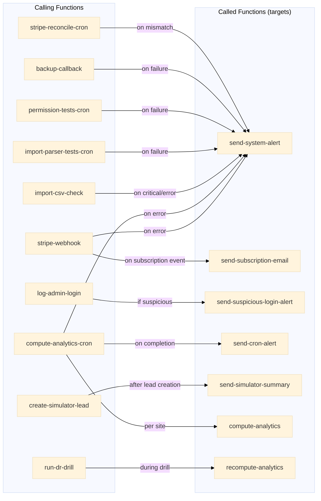

# Edge Functions Dependency Map

> Complete inter-function call graph and shared module analysis for 90+ edge functions.

---

## 1. Function-to-Function Call Graph (Mermaid)

---

## 2. Shared Modules (`_shared/`)

| Module | Purpose | Used by |
|--------|---------|---------|
| `cors.ts` | CORS headers for browser requests | Most public-facing functions |
| `auth.ts` | Auth helper (verify JWT, get user) | Functions requiring authentication |
| `rate-limiter.ts` | Rate limiting logic | Import, contact, auth functions |
| `validation.ts` | Input validation utilities | Various functions |
| `feature-flags.ts` | Feature flag checks | Functions with gated features |
| `mfa.ts` | MFA verification helpers | MFA-related functions |

---

## 3. Functions by Domain

### 3.1 Authentication & Security (15 functions)
| Function | Triggers | Calls | Purpose |
|----------|----------|-------|---------|
| `auth-signup` | Client | — | Custom signup flow |
| `log-login` | Client | — | Log login to login_logs |
| `log-login-event` | Client | — | Log to auth_login_events with risk |
| `log-admin-login` | Client | `send-suspicious-login-alert` | Admin login + suspicion check |
| `send-login-otp` | Client | — | Send OTP email |
| `verify-login-otp` | Client | — | Verify OTP code |
| `require-mfa` | Client | — | Initiate MFA challenge |
| `verify-mfa-challenge` | Client | — | Verify MFA challenge |
| `generate-recovery-codes` | Client | — | Generate MFA recovery codes |
| `verify-recovery-code` | Client | — | Verify recovery code |
| `remove-trusted-device` | Client | — | Remove trusted device |
| `revoke-other-sessions` | Client | — | Revoke all other sessions |
| `send-suspicious-login-alert` | `log-admin-login` | — | Email alert for suspicious login |
| `start-impersonation` | Admin | — | Start admin impersonation |
| `end-impersonation` | Admin | — | End impersonation session |
| `get-impersonation-session` | Admin | — | Check active impersonation |

### 3.2 Billing & Stripe (7 functions)
| Function | Triggers | Calls | Purpose |
|----------|----------|-------|---------|
| `stripe-webhook` | Stripe | `send-system-alert`, `send-subscription-email` | Process Stripe events |
| `create-subscription-checkout` | Client | — | Create Stripe checkout session |
| `customer-portal` | Client | — | Redirect to Stripe portal |
| `list-invoices` | Client | — | List user invoices |
| `stripe-reconcile-cron` | Cron | `send-system-alert` | Reconcile Stripe vs DB |
| `trial-reminder` | Cron | — | Send trial ending reminders |
| `send-subscription-email` | `stripe-webhook` | — | Subscription status emails |

### 3.3 Analytics & Computation (4 functions)
| Function | Triggers | Calls | Purpose |
|----------|----------|-------|---------|
| `compute-analytics` | `compute-analytics-cron`, Client | — | Compute analytics for one site |
| `compute-analytics-cron` | Cron | `compute-analytics`, `send-system-alert`, `send-cron-alert` | Batch compute all sites |
| `recompute-analytics` | Client, `run-dr-drill` | — | Full recompute for a site |
| `log-performance` | Client | — | Log performance metrics |

### 3.4 Import & Data (3 functions)
| Function | Triggers | Calls | Purpose |
|----------|----------|-------|---------|
| `import-csv-check` | Client | `send-system-alert` | Validate CSV import integrity |
| `import-parser-tests-cron` | Cron | `send-system-alert` | Run parser regression tests |
| `fetch-from-siret` | Client | — | Fetch company info from SIRET |

### 3.5 Export & Reports (5 functions)
| Function | Triggers | Calls | Purpose |
|----------|----------|-------|---------|
| `create-export-job` | Client | — | Create async export job |
| `run-export-job` | Internal | — | Execute export job |
| `get-export-download-url` | Client | — | Get signed download URL |
| `generate-fin-export` | Client | — | Export financial projections |
| `generate-financial-pdf` | Client | — | Generate financial PDF |

### 3.6 Alerting & Notifications (6 functions)
| Function | Triggers | Calls | Purpose |
|----------|----------|-------|---------|
| `send-system-alert` | Multiple functions | — | System alert (email/Slack) |
| `send-cron-alert` | `compute-analytics-cron` | — | Cron completion alert |
| `send-audit-alert` | Internal | — | Audit alert |
| `send-audit-report` | Cron | — | Periodic audit report |
| `send-permission-alert` | Internal | — | Permission change alert |
| `send-orphan-page-alert` | Internal | — | Orphan page detection alert |
| `check-churn-alert` | Cron | — | Churn risk alert |

### 3.7 Backup & Compliance (9 functions)
| Function | Triggers | Calls | Purpose |
|----------|----------|-------|---------|
| `backup-system` | Client/Cron | — | Trigger backup |
| `backup-callback` | Webhook | `send-system-alert` | Handle backup completion |
| `backup-drill-reminder` | Cron | — | Remind to run DR drills |
| `verify-archive-integrity` | Client | — | Verify single archive |
| `verify-archives-bulk` | Client | — | Bulk archive verification |
| `generate-compliance-report` | Client | — | Generate compliance report |
| `get-compliance-report-download-url` | Client | — | Download compliance report |
| `verify-compliance-report-integrity` | Client | — | Verify report integrity |
| `monthly-compliance-report` | Cron | — | Auto-generate monthly report |

### 3.8 Cleanup & Maintenance (4 functions)
| Function | Triggers | Calls | Purpose |
|----------|----------|-------|---------|
| `cleanup-audit-logs` | Cron | — | Purge old audit logs |
| `cleanup-audit-archives` | Cron | — | Purge old archives |
| `cleanup-compliance-reports` | Cron | — | Purge old reports |
| `cleanup-login-logs` | Cron | — | Purge old login logs |

### 3.9 DR & Diagnostics (4 functions)
| Function | Triggers | Calls | Purpose |
|----------|----------|-------|---------|
| `run-dr-drill` | Client | `recompute-analytics` | Execute DR drill |
| `dr-drill-reminder` | Cron | — | DR drill reminder |
| `collect-diagnostics` | Client | — | Collect diagnostic bundle |
| `secrets-health` | Client | — | Check secrets configuration |

### 3.10 Simulator & Lead Gen (4 functions)
| Function | Triggers | Calls | Purpose |
|----------|----------|-------|---------|
| `create-simulator-lead` | Client | `send-simulator-summary` | Capture simulator lead |
| `create-simulator-checkout` | Client | — | Simulator purchase checkout |
| `create-addon-checkout` | Client | — | Addon purchase checkout |
| `send-simulator-summary` | `create-simulator-lead` | — | Email simulator summary |

### 3.11 Beta Management (4 functions)
| Function | Triggers | Calls | Purpose |
|----------|----------|-------|---------|
| `enroll-company-in-beta` | Admin | — | Enroll company in beta |
| `end-beta-early` | Admin | — | End beta early |
| `beta-inactivity-check` | Cron | — | Check beta inactivity |
| `log-beta-event` | Client | — | Log beta events |
| `submit-beta-feedback` | Client | — | Submit beta feedback |

### 3.12 Organization & Teams (5 functions)
| Function | Triggers | Calls | Purpose |
|----------|----------|-------|---------|
| `send-team-invitation` | Client | — | Send team invitation email |
| `send-admin-invitation` | Admin | — | Send admin invitation |
| `accept-invitation` | Client | — | Accept team invitation |
| `validate-invitation` | Client | — | Validate invitation token |
| `close-laundromat` | Client | — | Close a laundromat |
| `reactivate-laundromat` | Client | — | Reactivate closed laundromat |

### 3.13 Misc (8 functions)
| Function | Triggers | Calls | Purpose |
|----------|----------|-------|---------|
| `send-contact` | Client | — | Send contact form email |
| `submit-expert-request` | Client | — | Submit expert request |
| `support-chatbot` | Client | — | AI support chatbot |
| `ai-hypothesis-suggest` | Client | — | AI hypothesis suggestions |
| `ai-proxy` | Client | — | Generic AI proxy |
| `log-event` | Client | — | Generic event logging |
| `csp-report` | Browser | — | CSP violation reports |
| `validate-postal-code` | Client | — | Validate French postal code |
| `create-project` | Client | — | Create project |
| `evaluate-platform-readiness` | Client | — | Evaluate readiness |
| `check-webhook-status` | Cron | — | Check webhook health |
| `smoke-tests-cron` | Cron | — | Run smoke tests |
| `permission-tests-cron` | Cron | `send-system-alert` | Run permission tests |
| `get-audit-archive-download-url` | Client | — | Download audit archive |

---

## 4. Trigger Types Summary

| Trigger | Count | Examples |
|---------|-------|---------|
| **Client** (user-initiated) | ~45 | auth-signup, create-export-job, import-csv-check |
| **Cron** (scheduled) | ~15 | compute-analytics-cron, cleanup-*, trial-reminder |
| **Webhook** (external) | 2 | stripe-webhook, backup-callback |
| **Internal** (called by other functions) | 7 | send-system-alert, compute-analytics, send-subscription-email |

---

## 5. Most Called Functions

| Function | Called by | Call type |
|----------|----------|-----------|
| `send-system-alert` | 7 functions | Error/critical notifications |
| `compute-analytics` | 1 function (cron) | Per-site analytics computation |
| `send-subscription-email` | 1 function (stripe-webhook) | Subscription lifecycle emails |
| `send-cron-alert` | 1 function (cron) | Cron completion reports |
| `send-suspicious-login-alert` | 1 function | Security alerts |
| `send-simulator-summary` | 1 function | Lead notification |
| `recompute-analytics` | 1 function (dr-drill) | Full analytics recompute |
