# Hook Dependency Map

> Auto-generated dependency analysis of `src/hooks/` — 90+ custom hooks.

---

## 1. Dependency Graph (Mermaid)

```mermaid
%%{init: {'theme': 'base'}}%%
graph TD
    subgraph Foundation["Foundation Hooks (no hook deps)"]
        useAuth
        useToast["use-toast"]
        useDebounce
        useRipple
        useScrollReveal
        useActiveSection
        useFormPersistence
        useLocale
        useViewMode
        useRefreshState
        useABVariant
        useDeviceFingerprint
        useFormatters
        useDateRange
        useFeatureFlag
        useMobile["use-mobile"]
        useTheme["use-theme"]
        useUnsavedChangesWarning
    end

    subgraph Tier1["Tier 1 — Depends on useAuth only"]
        useActiveLaundromat --> useAuth
        useAnalytics --> useAuth
        useAIUsage --> useAuth
        useAnonymousBenchmarks --> useAuth
        useAuthSecurityLogs --> useAuth
        useBetaStatus --> useAuth
        useChartPreferences --> useAuth
        useDashboardStats --> useAuth
        useHasData --> useAuth
        useHasOperations --> useAuth
        useImportBatches --> useAuth
        useIsBetaCompany --> useAuth
        useIsAdmin --> useAuth
        useLoginLogger --> useAuth
        useLoginSecurity --> useAuth
        useOperations --> useAuth
        useOrganization --> useAuth
        usePlatformRole --> useAuth
        useRecommendationsSuppressed --> useAuth
        useSecurityHealth --> useAuth
        useSubscription --> useAuth
        useUserGoals --> useAuth
        useUxFeedback --> useAuth
    end

    subgraph Tier1b["Tier 1 — Depends on use-toast only"]
        useExportJobs --> useToast
        useFinHypotheses --> useToast
        useFinLineItems --> useToast
        useFinForecast --> useToast
        useFinProjects --> useToast
        useImportRateLimit --> useToast
        useSecureUpload --> useToast
        useMfaChallenge --> useToast
    end

    subgraph Tier2["Tier 2 — Depends on Tier 1"]
        useAuditLog --> useAuth
        useSites --> useAuth
        useSites --> useAuditLog
        useCurrentSite --> useSites
        useCurrentSite --> useActiveLaundromat

        useAnalyticsRefresh --> useToast
        useAnalyticsRefresh --> useRefreshState

        useOperationsImport --> useAuth
        useOperationsImport --> useAnalyticsRefresh

        useCanonicalImport --> useAuth
        useCanonicalImport --> useAnalyticsRefresh

        useSiteCosts --> useAuth
        useSiteCosts --> useCurrentSite

        useChartsData --> useCurrentSite
        useChartsData --> useDateRange

        useDataQuality --> useCurrentSite
        useDataQuality --> useAuth

        useBetaEvents --> useAuth
        useBetaEvents --> useIsBetaCompany

        useOrganizationPrivacySettings --> useAuth
        useOrganizationPrivacySettings --> useOrganization

        usePermissionAuditLogs --> useAuth
        usePermissionAuditLogs --> useOrganization

        useCurrentUserPermissions --> useAuth
        useCurrentUserPermissions --> useOrganization

        useUserPermissions --> useAuth
        useUserPermissions --> useOrganization

        useDemoMode --> useAuth
        useDemoMode --> useToast

        useLogout --> useToast
    end

    subgraph Tier3["Tier 3 — Depends on Tier 2"]
        useProfitability --> useSiteCosts
        useProfitability --> useDashboardStats
        useProfitability --> useCurrentSite

        useOnboardingStatus --> useImportBatches
        useOnboardingStatus --> useSites
        useOnboardingStatus --> useDashboardStats

        useBetaOnboarding --> useAuth
        useBetaOnboarding --> useIsBetaCompany
        useBetaOnboarding --> useBetaEvents

        useDemoContext --> useAuth
        useDemoContext --> useCurrentSite
        useDemoContext --> useToast

        useBetaChecklistTracker --> useBetaOnboarding
        useBetaChecklistTracker --> useActiveLaundromat
        useBetaChecklistTracker --> useBetaEvents

        useBetaConversionReadiness --> useBetaOnboarding

        usePlatformReadiness --> useAuth
    end

    subgraph Tier4["Tier 4 — Depends on Tier 3"]
        useSetupProgress --> useOnboardingStatus
        useOnboarding --> useOnboardingStatus
    end
```

---

## 2. Hook Catalog by Category

### 2.1 Auth & Security
| Hook | Depends on | Purpose |
|------|-----------|---------|
| `useAuth` | — | Core auth state (user, session, loading) |
| `useIsAdmin` | useAuth | Check super-admin platform role |
| `usePlatformRole` | useAuth | Read platform_roles table |
| `useLoginLogger` | useAuth | Log login events |
| `useLoginSecurity` | useAuth | Auth login events & risk levels |
| `useAuthSecurityLogs` | useAuth | Auth security audit logs |
| `useSecurityHealth` | useAuth | Security health score calculation |
| `useMfaChallenge` | use-toast | MFA challenge flow |
| `useDeviceFingerprint` | — | Browser fingerprinting |
| `useLogout` | use-toast | Sign out with cleanup |
| `usePasswordBreachCheck` | — | HIBP password check |

### 2.2 Data & Analytics
| Hook | Depends on | Purpose |
|------|-----------|---------|
| `useDashboardStats` | useAuth | Main dashboard KPIs |
| `useAnalytics` | useAuth | Analytics daily data |
| `useAnalyticsRefresh` | use-toast, useRefreshState | Trigger recompute-analytics |
| `useAnalyticsRpc` | — | Direct RPC analytics calls |
| `useAnalyticsState` | — | Site analytics state |
| `useChartsData` | useCurrentSite, useDateRange | Chart-specific data queries |
| `useChartPreferences` | useAuth | Persist chart filter preferences |
| `useOperations` | useAuth | CRUD on operations table |
| `useOperationsImport` | useAuth, useAnalyticsRefresh | Legacy import pipeline |
| `useCanonicalImport` | useAuth, useAnalyticsRefresh | New canonical import pipeline |
| `useMultiFormatImport` | — | Multi-format CSV parsing |
| `useImportBatches` | useAuth | Import batch history |
| `useImportRateLimit` | use-toast | Rate limiting for imports |
| `useDuplicateCheck` | — | Duplicate detection during import |
| `useDataQuality` | useCurrentSite, useAuth | Data quality metrics |
| `useHasData` | useAuth | Boolean: has analytics data |
| `useHasOperations` | useAuth | Boolean: has operations |

### 2.3 Sites & Organization
| Hook | Depends on | Purpose |
|------|-----------|---------|
| `useSites` | useAuth, useAuditLog | CRUD sites |
| `useCurrentSite` | useSites, useActiveLaundromat | Active site selection |
| `useActiveLaundromat` | useAuth | Persisted active site ID |
| `useLaundromatStatus` | — | Site open/closed status |
| `useOrganization` | useAuth | Organization membership |
| `useOrganizationPrivacySettings` | useAuth, useOrganization | Privacy consent |
| `useSiteCosts` | useAuth, useCurrentSite | Site cost structure |
| `useAddressSearch` | — | Address autocomplete |
| `useCitySearch` | — | City search |

### 2.4 Financial Module (Simulator)
| Hook | Depends on | Purpose |
|------|-----------|---------|
| `useFinProjects` | use-toast | CRUD fin_projects |
| `useFinHypotheses` | use-toast | CRUD fin_hypotheses |
| `useFinLineItems` | use-toast | CRUD fin_line_items |
| `useFinForecast` | use-toast | Read/compute forecasts |
| `useFinAccess` | — | Workspace access check |
| `useSimulationProject` | — | Active simulation project |
| `useSimulationValidation` | — | Validate simulation inputs |
| `useSimulatorAccess` | — | Simulator purchase access |
| `useSimulatorAddons` | — | Addon management |
| `useSimulatorCheckout` | — | Stripe checkout for simulator |
| `useProfitability` | useSiteCosts, useDashboardStats, useCurrentSite | Profitability calculations |

### 2.5 Beta & Onboarding
| Hook | Depends on | Purpose |
|------|-----------|---------|
| `useIsBetaCompany` | useAuth | Check beta enrollment |
| `useBetaStatus` | useAuth | Full beta status |
| `useBetaEvents` | useAuth, useIsBetaCompany | Log beta events |
| `useBetaOnboarding` | useAuth, useIsBetaCompany, useBetaEvents | Beta onboarding checklist |
| `useBetaChecklistTracker` | useBetaOnboarding, useActiveLaundromat, useBetaEvents | Auto-track checklist |
| `useBetaConversionReadiness` | useBetaOnboarding | Conversion readiness score |
| `useOnboardingStatus` | useImportBatches, useSites, useDashboardStats | 3-step onboarding tracker |
| `useOnboarding` | useOnboardingStatus | Onboarding UI state |
| `useSetupProgress` | useOnboardingStatus | Setup progress bar |

### 2.6 Permissions & Audit
| Hook | Depends on | Purpose |
|------|-----------|---------|
| `useAuditLog` | useAuth | Write audit_logs |
| `usePermissionAuditLogs` | useAuth, useOrganization | Read permission audit logs |
| `useCurrentUserPermissions` | useAuth, useOrganization | Current user's permissions |
| `useUserPermissions` | useAuth, useOrganization | Manage user permissions |

### 2.7 UX & Utilities
| Hook | Depends on | Purpose |
|------|-----------|---------|
| `use-toast` | — | Toast notifications |
| `use-mobile` | — | Mobile breakpoint detection |
| `use-theme` | — | Theme toggle |
| `useDebounce` | — | Debounced value |
| `useRipple` | — | Material ripple effect |
| `useScrollReveal` | — | Scroll-triggered animations |
| `useActiveSection` | — | Active nav section tracker |
| `useFormPersistence` | — | Form state persistence |
| `useViewMode` | — | List/grid view toggle |
| `useDateRange` | — | Date range picker state |
| `useLocale` | — | i18n locale management |
| `useFormatters` | — | Number/date formatters |
| `useABVariant` | — | A/B test variant assignment |
| `useFeatureFlag` | — | Feature flag checks |
| `useUnsavedChangesWarning` | — | Unsaved changes prompt |
| `useUxFeedback` | useAuth | UX feedback widget |
| `useTutorial` | — | Tutorial/guide state |

### 2.8 Subscription & Billing
| Hook | Depends on | Purpose |
|------|-----------|---------|
| `useSubscription` | useAuth | Subscription status |
| `useExportJobs` | use-toast | Export job management |
| `useSecureUpload` | use-toast | Secure file uploads |

### 2.9 Misc / Platform
| Hook | Depends on | Purpose |
|------|-----------|---------|
| `useAIUsage` | useAuth | AI usage tracking |
| `useAnonymousBenchmarks` | useAuth | Anonymous benchmark data |
| `useDemoContext` | useAuth, useCurrentSite, use-toast | Demo session management |
| `useDemoMode` | useAuth, use-toast | Demo mode toggle |
| `useKpiObjectives` | — | KPI objectives CRUD |
| `usePlatformReadiness` | useAuth | Platform readiness eval |
| `useRecommendationsSuppressed` | useAuth | Suppressed recommendations |
| `useUserGoals` | useAuth | Revenue/transaction goals |

---

## 3. Dependency Depth Summary

| Depth | Count | Examples |
|-------|-------|---------|
| 0 (leaf) | ~20 | useAuth, use-toast, useDebounce, useLocale |
| 1 | ~25 | useDashboardStats, useOperations, useIsAdmin |
| 2 | ~20 | useSites, useCurrentSite, useOperationsImport |
| 3 | ~10 | useProfitability, useOnboardingStatus, useBetaOnboarding |
| 4 | ~5 | useBetaChecklistTracker, useSetupProgress |

**Most depended-upon hooks:**
1. `useAuth` — 30+ dependents
2. `use-toast` — 15+ dependents
3. `useCurrentSite` — 5+ dependents
4. `useOrganization` — 4 dependents
5. `useDashboardStats` — 3 dependents
