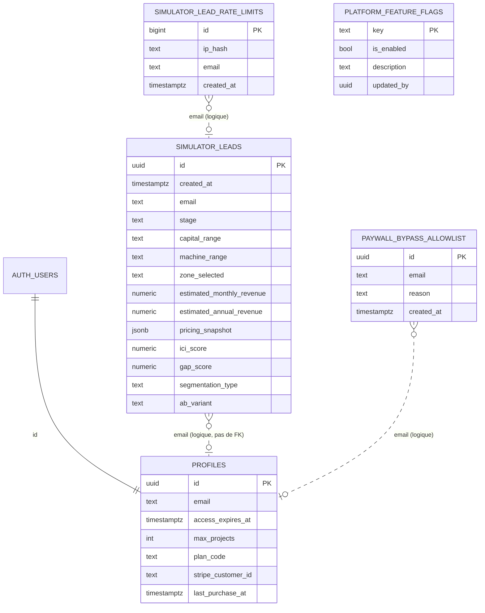
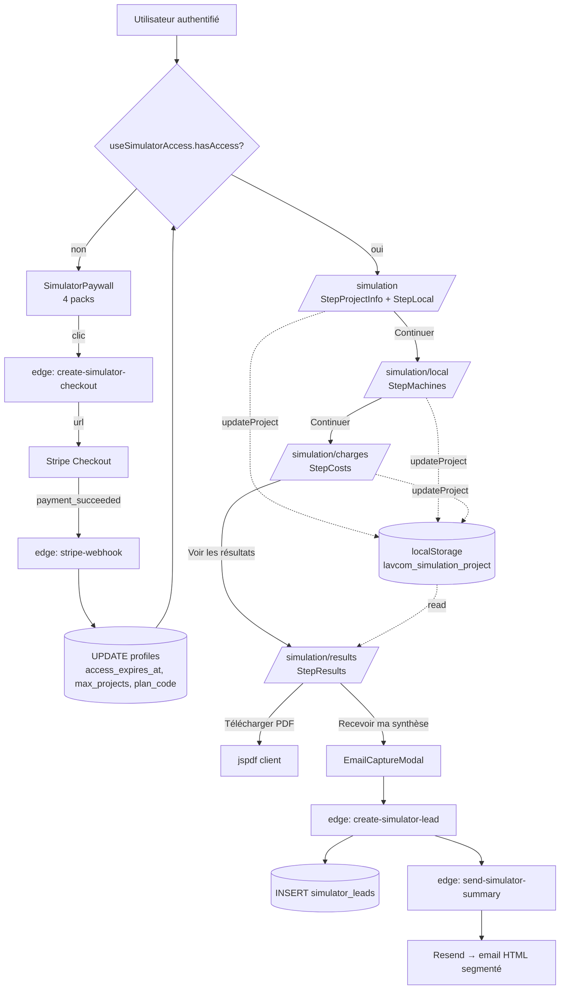
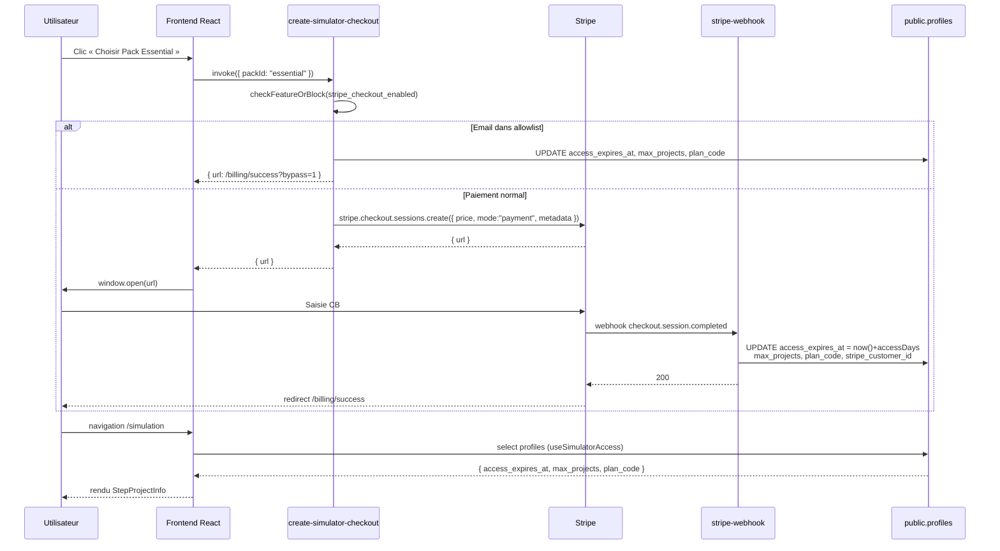

# Architecture du Simulateur payant (`/simulation`)

> Documentation technique exhaustive de la fonctionnalité « simulateur de rentabilité » accessible via la route `/simulation` de l'application Lavcom Performances.
>
> Périmètre : routes `/simulation*`, hooks/composants associés, edge functions, modèle de données.
> Hors périmètre : simulateur public gratuit `/simulateur`, business plan `/projections`.

---

## Table des matières
1. [Vue d'ensemble](#1-vue-densemble)
2. [Cartographie des routes & pages](#2-cartographie-des-routes--pages)
3. [Dictionnaire des variables (state applicatif)](#3-dictionnaire-des-variables-state-applicatif)
4. [Gestion du formulaire & persistance](#4-gestion-du-formulaire--persistance)
5. [Mapping inputs ↔ base de données](#5-mapping-inputs--base-de-données)
6. [Affichage dynamique par page](#6-affichage-dynamique-par-page)
7. [Schéma de base de données](#7-schéma-de-base-de-données)
8. [Edge functions impliquées](#8-edge-functions-impliquées)
9. [Frontend vs Backend (synthèse)](#9-frontend-vs-backend-synthèse)
10. [Diagrammes Mermaid](#10-diagrammes-mermaid)

---

## 1. Vue d'ensemble

Le simulateur payant `/simulation` est un **assistant en 4 étapes** qui permet à un porteur de projet de laverie de :
1. décrire son projet et son local,
2. dimensionner les machines (lave-linge / sèche-linge),
3. saisir les charges fixes et variables,
4. obtenir une simulation de chiffre d'affaires, de seuil de rentabilité et un PDF.

### Différence avec `/simulateur` (gratuit)
| Critère | `/simulateur` (public) | `/simulation` (SaaS payant) |
|---|---|---|
| Authentification | Non | Oui (Supabase Auth) |
| Paywall | Non | Oui — packs Stripe (`essential`, `project`, `comparator`, `premium`) |
| Contraintes du local | Non | Oui (forme, obstacles, porte, façade, technique) |
| Charges fixes/variables détaillées | Non | Oui (édition + ajout libre) |
| Persistance | localStorage | localStorage + accès BDD via `profiles.access_expires_at` |
| Export PDF | Light | Complet (`generateSimulationReport`) |
| Add-ons (extension, +projet) | Non | Oui (`create-addon-checkout`) |

### Conditions d'accès
L'accès au simulateur est gouverné par `useSimulatorAccess` (`src/hooks/useSimulatorAccess.ts`) qui lit `public.profiles` :
- `access_expires_at` doit être dans le futur,
- `max_projects` détermine le nombre de projets autorisés,
- `plan_code` détermine le tier (`essential` / `project` / `comparator` / `premium`),
- une **allowlist d'emails** (`SIMULATOR_BYPASS_EMAILS`) court-circuite le paywall (max 999 projets, tier premium).

### Schéma global
```text
[Utilisateur]
   │
   ▼
[/simulation*] ───► Hook useSimulationProject ───► localStorage (clé "lavcom_simulation_project")
   │                          │
   │                          └─► calculateSimulationResults() (pur, front-end)
   │
   ├─► Hook useSimulatorAccess ──► supabase.from("profiles")
   │
   ├─► EmailCaptureModal ──────► edge fn create-simulator-lead ──► simulator_leads + send-simulator-summary (Resend)
   │
   ├─► SimulatorPaywall ───────► edge fn create-simulator-checkout ──► Stripe ──► stripe-webhook ──► profiles.access_expires_at
   │
   └─► SimulatorAddonsSection ─► edge fn create-addon-checkout ─────► Stripe ──► stripe-webhook ──► profiles
```

---

## 2. Cartographie des routes & pages

Les routes sont déclarées dans `src/App.tsx` (lignes 182-185) et partagent toutes le layout `SimulationLayout` (sidebar + stepper).

| Route | Fichier page | Composant principal | Étape | Sortie navigation |
|---|---|---|---|---|
| `/simulation` | `src/pages/simulation/SimulationProjectPage.tsx` | `StepProjectInfo` + `StepLocal` (onglets) | 1 — Projet & localisation | → `/simulation/local` (si validation OK) |
| `/simulation/local` | `src/pages/simulation/SimulationLocalPage.tsx` | `StepMachines` | 2 — Local & machines | ← `/simulation` / → `/simulation/charges` |
| `/simulation/charges` | `src/pages/simulation/SimulationChargesPage.tsx` | `StepCosts` | 3 — Charges & financement | ← `/simulation/local` / → `/simulation/results` |
| `/simulation/results` | `src/pages/simulation/SimulationResultsPage.tsx` | `StepResults` | 4 — Résultats & rapport | ← `/simulation/charges` (boutons « Modifier » vers étapes) |

Composants transverses :
- `src/components/layout/SimulationLayout.tsx` : layout commun.
- `src/components/simulation/SimulationStepper.tsx` : indicateur d'étapes.
- `src/components/simulation/SimulatorPaywall.tsx` : écran de blocage quand `hasAccess === false`.
- `src/components/simulation/SimulatorAddonBanner.tsx` / `SimulatorAddonsSection.tsx` : achat d'add-ons.
- `src/components/simulation/EmailCaptureModal.tsx` : capture de lead + envoi e-mail.
- `src/components/simulation/SegmentedRedirect.tsx` : redirection segmentée après capture.
- `src/components/simulation/IciIndicators.tsx` : indicateurs « Indice de Cohérence Idéale » (ICI).

---

## 3. Dictionnaire des variables (state applicatif)

### 3.1 Objet `SimulationProject` (state principal — localStorage)
Source : `src/types/simulation.ts`.

| Variable | Type | Défaut | Page de saisie | Composant input | Événement | Validation (`useSimulationValidation`) |
|---|---|---|---|---|---|---|
| `id` | `string?` | `undefined` | — (BDD future) | — | — | non requis |
| `name` | `string` | `""` | `/simulation` | `<Input>` | `onChange` + `onBlur` (`formatUserInput`) | requis, ≥ 3 caractères |
| `country` | `string?` | `"FR"` | `/simulation` | `<Select>` (COUNTRIES) | `onValueChange` | — |
| `address` | `string?` | `undefined` | `/simulation` | `<AddressAutocomplete>` | `onSelect` (api-adresse.data.gouv.fr) | — |
| `city` | `string?` | `undefined` | `/simulation` | `<CityAutocomplete>` | `onSelect` | requis |
| `postal_code` | `string?` | `undefined` | `/simulation` | rempli auto via city/address | — | — |
| `department` | `string?` | `undefined` | `/simulation` | rempli auto | — | — |
| `location` | `string` | `""` | `/simulation` | dérivé (`"{ville} ({CP})"`) | — | — |
| `zone_type` | `string?` | `"urbain"` | `/simulation` | `<Select>` (ZONE_TYPES) | `onValueChange` | requis |
| `surface_m2` | `number` | `40` | `/simulation` | `<Select>` + `<Input number>` | `onValueChange` / `onChange` | requis, ≥ 10 |
| `opening_hours_description` | `string` | `"7h - 21h"` | `/simulation` | `<Select>` + `<Input>` | `onValueChange` / `onChange` | requis, non vide |
| `local_shape` | `LocalShape?` | `"rectangular"` | `/simulation` (onglet « Local ») | `<RadioGroup>` | `onValueChange` | — |
| `has_structural_obstacles` | `StructuralObstacles?` | `"none"` | `/simulation` (onglet « Local ») | `<RadioGroup>` | `onValueChange` | — |
| `door_width_cm` | `number?` | `90` | `/simulation` (onglet « Local ») | `<Input number>` | `onChange` | — |
| `can_modify_facade` | `FacadeModifiable?` | `"unknown"` | `/simulation` (onglet « Local ») | `<RadioGroup>` | `onValueChange` | — |
| `technical_constraints_level` | `TechnicalConstraintsLevel?` | `"check_with_installer"` | `/simulation` (onglet « Local ») | `<RadioGroup>` | `onValueChange` | — |
| `machines` | `MachineConfig[]` | 5 machines par défaut | `/simulation/local` | `<StepMachines>` (Select + 3 Inputs) | `onChange` + add/remove | — |
| `fixed_costs` | `FixedCostItem[]` | 6 charges par défaut | `/simulation/charges` | `<StepCosts>` | `onChange` + add/remove | — |
| `variable_costs` | `VariableCostItem[]` | 4 charges par défaut | `/simulation/charges` | `<StepCosts>` | `onChange` + add/remove | — |
| `created_at` / `updated_at` | `Date?` | non utilisé | — | — | — | — |

#### 3.1.1 `MachineConfig`
| Variable | Type | Saisie | Événement |
|---|---|---|---|
| `id` | `string` | auto (`${type}_${Date.now()}`) | bouton « Ajouter » |
| `type` | `'washer' \| 'dryer'` | déterminé par la colonne | — |
| `capacity_kg` | `number` | `<Select>` parmi `WASHER_CAPACITIES` / `DRYER_CAPACITIES` | `onValueChange` |
| `count` | `number` | `<Input number min=1>` | `onChange` |
| `price` | `number` | `<Input number step=0.5>` | `onChange` |
| `cycles_day` | `number` | `<Input number>` | `onChange` |

#### 3.1.2 `FixedCostItem`
| Variable | Type | Notes |
|---|---|---|
| `id` | `string` | défaut ou `fixed_${Date.now()}` |
| `label` | `string` | éditable pour abonnements (`<Select>` SUBSCRIPTION_TYPES) |
| `amount` | `number` | € / mois |
| `category` | `'rent' \| 'lease' \| 'subscription' \| 'insurance' \| 'tax' \| 'salary' \| 'cleaning' \| 'other'` | — |

Charges « système » non supprimables : `rent`, `charges`, `lease`, `insurance`, `cfe`, `cleaning`.

#### 3.1.3 `VariableCostItem`
| Variable | Type | Notes |
|---|---|---|
| `id` | `string` | défaut ou `var_${Date.now()}` |
| `label` | `string` | — |
| `percent` | `number` | % du CA (`min=0`, `max=100`, `step=0.5`) |
| `category` | `'electricity' \| 'water' \| 'gas' \| 'detergent' \| 'other'` | — |

Charges « système » non supprimables : `electricity`, `water`, `gas`, `detergent`.

### 3.2 Objet `SimulationResults` (recalculé en mémoire à chaque render)
Recalculé par `calculateSimulationResults(project)` enveloppé dans `useMemo` sur chaque page.

| Variable | Type | Formule |
|---|---|---|
| `machine_revenues[]` | `{id, turnover_month}[]` | `count × cycles_day × price × 30` par machine |
| `total_wash_turnover_month` | `number` | somme `machine_revenues` (washers) |
| `total_dry_turnover_month` | `number` | somme `machine_revenues` (dryers) |
| `project_turnover_month` | `number` | `wash + dry` |
| `total_cycles_month` | `number` | `Σ count × cycles_day × 30` |
| `avg_revenue_per_cycle` | `number` | `project_turnover_month / total_cycles_month` |
| `fixed_costs_total` | `number` | `Σ amount` |
| `var_total_percent` | `number` | `Σ percent` |
| `variable_costs_total` | `number` | `project_turnover × var_total_percent / 100` |
| `break_even_revenue_monthly` | `number \| null` | `fixed / (1 - var%/100)` (null si var ≥ 100) |
| `break_even_cycles_month` | `number \| null` | `break_even_revenue / avg_revenue_per_cycle` |
| `break_even_cycles_day` | `number \| null` | `break_even_cycles_month / 30` |
| `estimated_profit_month` | `number` | `CA − var − fixed` |

### 3.3 Objet `SimulatorAccess` (BDD-driven)
Source : `src/hooks/useSimulatorAccess.ts`.

| Variable | Source | Sens |
|---|---|---|
| `hasAccess` | `expires_at > now()` ou bypass email | autorise l'usage |
| `accessExpiresAt` | `profiles.access_expires_at` | date de fin |
| `maxProjects` | `profiles.max_projects` | quota |
| `planCode` | `profiles.plan_code` | identifiant du pack acheté |
| `tier` | dérivé (`getTierFromPlanCode`) | `essential` / `project` / `comparator` |
| `daysRemaining` | calcul ms → jours | UX (alertes J-7) |
| `isExpiringSoon` | `daysRemaining ≤ 7` | bandeau d'alerte |
| `projectsUsed` | TODO (0 actuellement) | quota dynamique |
| `isProjectLimitReached` | `projectsUsed ≥ maxProjects` | bloque création |

### 3.4 Objet `LeadData` (capture e-mail)
Source : `src/components/simulation/EmailCaptureModal.tsx`.

| Variable | Type | Origine |
|---|---|---|
| `email` | `string` | saisi par l'utilisateur (regex validé) |
| `segmentation_type` | `segment_a..d` | calculé via `computeSegment(qualifData, ici)` |
| `ici_score` | `number 0-100` | calculé via `computeIciAndGap()` |
| `gap_score` | `number` | `ambition − capital` |
| `stage`, `capital_range`, `machine_range` | `string` | `qualifData` (issue d'un pré-questionnaire) |
| `estimated_monthly_revenue` / `estimated_annual_revenue` | `number` | `results.project_turnover_month × {1,12}` |
| `ab_variant` | `"A" \| "B"` | `useABVariant("cta_button")` |

---

## 4. Gestion du formulaire & persistance

### 4.1 Le hook central `useSimulationProject`
Fichier : `src/hooks/useSimulationProject.ts`.

```ts
const STORAGE_KEY = "lavcom_simulation_project";
```

- **Initialisation** : `useState` lit `localStorage[STORAGE_KEY]` et fusionne avec `defaultSimulationProject` (compatibilité ascendante).
- **Persistance auto** : un `useEffect` réécrit le JSON complet dans le localStorage à chaque changement de `project`.
- **API exposée** :
  - `project` — état courant,
  - `updateProject(partial)` — `setProject(prev => ({ ...prev, ...updates }))`,
  - `setProject` — accès brut,
  - `resetProject()` — restaure les valeurs par défaut + purge localStorage,
  - `clearStorage()` — purge localStorage seul,
  - `isLoaded` — flag de premier render.

> **Aucune écriture en BDD pendant la saisie.** Tout vit côté client. La BDD n'est sollicitée que lors d'événements explicites : capture e-mail, paiement Stripe, achat d'add-on, et lecture du profil pour vérifier l'accès.

### 4.2 Validation
Fichier : `src/hooks/useSimulationValidation.ts`. Hook `useMemo` qui renvoie `{ isValid, errors, errorCount }`.
Champs requis : `name` (≥3), `city`, `zone_type`, `surface_m2` (≥10), `opening_hours_description`.
Le composant `SimulationProjectPage` affiche les erreurs uniquement si l'utilisateur clique sur « Continuer » (`setShowErrors(true)`).

### 4.3 Calcul des résultats
La fonction pure `calculateSimulationResults(project)` (dans `src/types/simulation.ts`) est invoquée dans chaque page sous `useMemo([project])`. Aucun appel BDD, aucune dépendance externe.

### 4.4 Fonctions utilitaires de cohérence
- `calculateMaxMachinesEstimate(project)` → `floor( (surface × 0.7 / 3.5) × shapeFactor × obstacleFactor )`,
- `getShapeFactor(localShape)` → 0.8–1.0,
- `getObstacleFactor(obstacles)` → 0.8–1.0,
- `getTotalUserMachines(project)`,
- `hasLargeWashers(project)` → existence d'un washer ≥18 kg.

Ces fonctions alimentent les **avertissements** affichés dans `StepResults` (capacité dépassée, porte trop étroite, gros travaux).

---

## 5. Mapping inputs ↔ base de données

### 5.1 Pendant la saisie
**Aucun mapping BDD**. Toutes les variables du formulaire sont stockées sous la clé `lavcom_simulation_project` (localStorage) au format JSON sérialisé du `SimulationProject`.

### 5.2 Lors de la capture e-mail (`EmailCaptureModal` → `create-simulator-lead`)
Mapping JS → colonne `public.simulator_leads` (insertion via service-role) :

| Champ formulaire / state | Colonne BDD | Type |
|---|---|---|
| `email` (Input) | `email` | text |
| `qualifData.stage` | `stage` | text |
| `qualifData.capital_range` | `capital_range` | text |
| `qualifData.machine_range` | `machine_range` | text |
| `project.zone_type` | `zone_selected` | text |
| `results.project_turnover_month` | `estimated_monthly_revenue` | numeric |
| `results.project_turnover_month × 12` | `estimated_annual_revenue` | numeric |
| `(snapshot machines/prices)` | `pricing_snapshot` | jsonb |
| `computeIciAndGap().ici` | `ici_score` | numeric |
| `computeIciAndGap().gap` | `gap_score` | numeric |
| `computeSegment()` | `segmentation_type` | text |
| `useABVariant()` | `ab_variant` | text (`'A'` défaut) |

Anti-abus :
- honeypot `website` (silently accept si rempli),
- `elapsed_ms` < 1500 → 429,
- IP hashée + `simulator_lead_rate_limits` (3/min, 15/jour).

### 5.3 Lors du paiement d'un pack (`SimulatorPaywall` → `create-simulator-checkout`)
- Le frontend envoie `{ packId }` (ex. `"essential"`).
- L'edge function mappe `packId` → Stripe `priceId` + métadonnées `{ accessDays, maxProjects, amountTtc }`.
- Le webhook `stripe-webhook` met à jour `profiles` pour l'utilisateur :

| Champ Stripe | Colonne `public.profiles` |
|---|---|
| metadata.pack_id | `plan_code` |
| `now + accessDays × 86400000` | `access_expires_at` |
| pack.maxProjects | `max_projects` |
| customer.id | `stripe_customer_id` |
| event timestamp | `last_purchase_at` |

> Pour les emails bypass, l'edge function écrit directement dans `profiles` sans passer par Stripe.

### 5.4 Lors de l'achat d'un add-on (`SimulatorAddonsSection` → `create-addon-checkout`)
- Envoie `{ addon_kind, tier }`.
- Stripe checkout en mode `payment` (one-time).
- Metadata enrichies : `{ user_id, addon_kind, tier, type: "addon", days?, projects_delta? }`.
- Le webhook applique côté `profiles` la logique GREATEST :
  - `extension_30d` : `access_expires_at = GREATEST(access_expires_at, now()) + days`,
  - `project_plus1` : `max_projects = max_projects + projects_delta`.

### 5.5 Export PDF (`StepResults` → `generateSimulationReport`)
Côté **client uniquement** (`src/utils/simulationPdfExport.ts` via `jspdf` + `jspdf-autotable`). Le PDF est généré à partir du `project` et `results` actuels. Aucune écriture BDD.

---

## 6. Affichage dynamique par page

### 6.1 `/simulation` — `SimulationProjectPage`
- **Tabs** (`<Tabs>` shadcn) : `project` / `local`.
- `StepProjectInfo` rend : nom, pays, adresse autocomplete (FR), ville autocomplete, code postal (read-only), zone, département (auto), surface, horaires.
- `StepLocal` rend : forme du local (RadioGroup × 4), obstacles structurels, largeur de porte, façade modifiable, contraintes techniques.
- **Validation visuelle** : badge rouge sur l'onglet « Mon projet » avec `errorCount` si `showErrors === true`.
- **Bouton « Réinitialiser »** : `AlertDialog` shadcn + `resetProject()` (purge localStorage).

### 6.2 `/simulation/local` — `SimulationLocalPage` (`StepMachines`)
- Deux colonnes : Lave-linge / Sèche-linge.
- Pour chaque machine : capacité (Select), nombre, prix, cycles/jour.
- Revenue par machine affiché en live : `results.machine_revenues.find(id).turnover_month` (formaté `Intl.NumberFormat fr-FR EUR`).
- Cartes de totaux : `total_wash_turnover_month`, `total_dry_turnover_month`, `project_turnover_month`.
- Boutons `addMachine`, `removeMachine`, `updateMachine` mutent `project.machines` via `onUpdate`.

### 6.3 `/simulation/charges` — `SimulationChargesPage` (`StepCosts`)
- Deux colonnes : charges fixes / charges variables.
- Charges fixes groupées : « hors abonnements » + section dédiée « Abonnements » (`<Select>` SUBSCRIPTION_TYPES).
- Boutons d'ajout par catégorie (8 catégories fixes, 5 variables).
- Charges système (id `rent`, `lease`, `insurance`, `cfe`, `cleaning`, `electricity`, `water`, `gas`, `detergent`) non supprimables (bouton Trash masqué).
- Card de bas de page : aperçu seuil de rentabilité (`break_even_revenue_monthly`, `break_even_cycles_day`).

### 6.4 `/simulation/results` — `SimulationResultsPage` (`StepResults`)
- **3 cards principales** : résumé projet, recettes, rentabilité (bordure verte si `estimated_profit_month ≥ 0`, rouge sinon).
- **Message de conclusion** : conditionnel selon `isProfitable`.
- **`IciIndicators`** : score ICI + interprétation (cohérence ambition/capital).
- **Avertissements** (Alert shadcn) :
  - `showCapacityWarning = userTotalMachines > maxMachinesEstimate`,
  - `showDoorWarning = door_width_cm < 90 && can_modify_facade === 'no' && hasLargeWashers`,
  - `showTechnicalWarning = technical_constraints_level === 'heavy_works'`.
- **Actions** : Modifier les charges / Télécharger PDF / Recevoir ma synthèse (si `qualifData`).
- **CTA Premium** vers `/subscribe-simulator`.
- Si `leadData` est défini (post-capture e-mail) → render `<SegmentedRedirect>` à la place du contenu.

### 6.5 Composants conditionnels transverses
| Composant | Condition d'affichage | Données consommées |
|---|---|---|
| `SimulatorPaywall` | `!access.hasAccess` (au montage de toute page `/simulation*` via `ProtectedRoute`) | `SIMULATOR_PACKS` |
| `SimulatorAddonBanner` | `isExpiringSoon || isProjectLimitReached` | `SimulatorAccess` |
| `SimulatorAddonsSection` | `access.tier !== 'premium'` | `ADDON_PRICING[tier]` |
| `EmailCaptureModal` | clic « Recevoir ma synthèse » | `qualifData`, `results`, `project` |
| `SegmentedRedirect` | `leadData !== null` (après capture) | `LeadData` |

---

## 7. Schéma de base de données

### 7.1 Dictionnaire de données

#### `public.profiles`
Stocke les informations utilisateur et — pour le simulateur — l'état d'accès.

| Colonne | Type | NULL | Défaut | Rôle simulateur |
|---|---|---|---|---|
| `id` | uuid | NO | — | FK vers `auth.users` |
| `email` | text | NO | — | identité |
| `first_name`, `last_name`, `company_name`, `siret`, `phone`, `avatar_url` | text | YES | — | profil hors simulateur |
| `created_at`, `updated_at` | timestamptz | YES | now() | métadonnées |
| `log_retention_days` | int | NO | 90 | hors simulateur |
| **`access_expires_at`** | timestamptz | YES | NULL | **expiration du pack simulateur** |
| **`max_projects`** | int | YES | 0 | **quota projets simulateur** |
| **`plan_code`** | text | YES | NULL | **identifiant pack (essential/project/comparator/premium)** |
| `last_purchase_at` | timestamptz | YES | NULL | dernier achat |
| `stripe_customer_id` | text | YES | NULL | corrélation Stripe |

#### `public.simulator_leads`
Leads issus de la capture e-mail dans `StepResults`.

| Colonne | Type | NULL | Défaut |
|---|---|---|---|
| `id` | uuid | NO | gen_random_uuid() |
| `created_at` | timestamptz | NO | now() |
| `email` | text | NO | — |
| `stage` | text | YES | — |
| `capital_range` | text | YES | — |
| `machine_range` | text | YES | — |
| `zone_selected` | text | YES | — |
| `estimated_monthly_revenue` | numeric | YES | — |
| `estimated_annual_revenue` | numeric | YES | — |
| `pricing_snapshot` | jsonb | YES | — |
| `ici_score` | numeric | YES | — |
| `gap_score` | numeric | YES | — |
| `segmentation_type` | text | YES | — (segment_a..d) |
| `ab_variant` | text | YES | `'A'` |

#### `public.simulator_lead_rate_limits`
Anti-abus IP pour la capture e-mail.

| Colonne | Type | NULL | Défaut |
|---|---|---|---|
| `id` | bigint | NO | sequence |
| `ip_hash` | text | NO | — (SHA-256 salé) |
| `email` | text | YES | — |
| `created_at` | timestamptz | NO | now() |

#### `public.paywall_bypass_allowlist`
Allowlist serveur (complémentaire à la liste hardcodée frontend `SIMULATOR_BYPASS_EMAILS`).

| Colonne | Type | NULL | Défaut |
|---|---|---|---|
| `id` | uuid | NO | gen_random_uuid() |
| `email` | text | NO | — |
| `reason` | text | YES | — |
| `created_at` | timestamptz | YES | now() |

#### `public.platform_feature_flags`
Kill switches globaux. Utilisé par `create-simulator-checkout` et `create-addon-checkout` (flag `stripe_checkout_enabled`) pour désactiver instantanément les paiements.

| Colonne | Type | NULL | Défaut |
|---|---|---|---|
| `key` | text | NO | — |
| `is_enabled` | boolean | NO | true |
| `description` | text | YES | — |
| `updated_at` | timestamptz | NO | now() |
| `updated_by` | uuid | YES | — |

### 7.2 Diagramme ER



> Les relations `email` entre `simulator_leads`, `profiles`, `paywall_bypass_allowlist` ne sont **pas** matérialisées par des FK — l'application les corrèle par adresse e-mail normalisée (`lower(trim(...))`).

---

## 8. Edge functions impliquées

| Fonction | Déclencheur | Entrée | Sortie | Effets BDD / externes |
|---|---|---|---|---|
| **`create-simulator-checkout`** | `useSimulatorCheckout.checkout(packId)` (clic pack dans `SimulatorPaywall`) | `{ packId }` | `{ url, bypass? }` | Crée session Stripe (mode `payment`) ou applique le bypass (UPDATE `profiles`). Vérifie `stripe_checkout_enabled`. |
| **`create-addon-checkout`** | `useSimulatorAddons.purchaseAddon()` | `{ addon_kind, tier }` (Bearer auth) | `{ url }` | Stripe session avec metadata `{ type:"addon", days?, projects_delta? }`. Le webhook applique GREATEST sur `profiles`. |
| **`create-simulator-lead`** | `EmailCaptureModal.persistLead()` | `{ email, stage, capital_range, ..., website, elapsed_ms }` | `{ success }` | Anti-abus (honeypot, min 1500 ms, rate-limit IP), INSERT `simulator_leads` + `simulator_lead_rate_limits`, déclenche `send-simulator-summary` en `EdgeRuntime.waitUntil`. |
| **`send-simulator-summary`** | `create-simulator-lead` (fire-and-forget) | payload normalisé du lead | `200` | Construit un HTML par segment (a/b/c/d) avec projection 3 ans + détail machines, envoie via Resend. CTA dynamique selon score ICI. |
| **`stripe-webhook`** | Stripe event (`checkout.session.completed`, `payment_intent.succeeded`) | event Stripe signé | `200` | UPDATE `profiles.access_expires_at`, `max_projects`, `plan_code`, `stripe_customer_id`, `last_purchase_at`. Pour add-ons : GREATEST(date, now)+days, `max_projects += projects_delta`. Déclenche `send-subscription-email`. |
| **`stripe-reconcile-cron`** | Cron quotidien | — | logs | Réconciliation des sessions manquantes (ignore IDs introuvables). Alerte via `send-cron-alert` en cas d'écart. |
| **`validate-postal-code`** *(satellite)* | `CityAutocomplete` (selon implémentation) | `{ postal_code, country }` | `{ valid, city, department }` | Lecture seule. |

### 8.1 Pas appelées depuis `/simulation` mais corrélées
- `customer-portal` : portail Stripe pour gérer factures (depuis pages /billing).
- `list-invoices` : affichage historique de facturation.
- `support-chatbot` : assistance IA (orphan `/help`).

---

## 9. Frontend vs Backend (synthèse)

| Fonctionnalité | Frontend (React) | Backend (edge function / DB) |
|---|---|---|
| Rendu du formulaire 4 étapes | ✅ tout React (`StepProjectInfo`, `StepLocal`, `StepMachines`, `StepCosts`, `StepResults`) | — |
| Autocomplete adresse / ville | ✅ appel api-adresse.data.gouv.fr **direct depuis le navigateur** | — |
| Validation des champs | ✅ `useSimulationValidation` (pure fn) | — |
| Persistance des saisies | ✅ `localStorage` (`lavcom_simulation_project`) | ❌ Aucune écriture BDD |
| Calcul des KPI (CA, seuil, profit) | ✅ `calculateSimulationResults` (pur) | — |
| Avertissements local (capacité, porte, technique) | ✅ `calculateMaxMachinesEstimate`, `hasLargeWashers` | — |
| Vérification d'accès au simulateur | ✅ hook `useSimulatorAccess` | ✅ `select profiles` |
| Allowlist bypass | ✅ hardcodée frontend | ✅ `paywall_bypass_allowlist` + check edge `create-simulator-checkout` |
| Paywall (affichage packs) | ✅ `SimulatorPaywall` | — |
| Création session Stripe (pack) | déclenchement | ✅ `create-simulator-checkout` |
| Création session Stripe (add-on) | déclenchement | ✅ `create-addon-checkout` |
| Activation des droits post-paiement | — | ✅ `stripe-webhook` → UPDATE `profiles` |
| Kill switch Stripe | — | ✅ `platform_feature_flags.stripe_checkout_enabled` |
| Capture lead e-mail | ✅ `EmailCaptureModal` + honeypot + temps min | ✅ `create-simulator-lead` (anti-abus, INSERT) |
| Envoi e-mail de synthèse | — | ✅ `send-simulator-summary` (Resend, HTML segmenté) |
| Score ICI | ✅ `computeIciAndGap` (frontend) — recopié serveur pour HTML e-mail | partiel |
| Génération PDF | ✅ `generateSimulationReport` (jspdf, **100% client**) | — |
| Redirection segmentée post-capture | ✅ `SegmentedRedirect` | — |

---

## 10. Diagrammes Mermaid

### 10.1 Parcours utilisateur



### 10.2 Flux de paiement



### 10.3 Modèle de données

Voir section [7.2](#72-diagramme-er).

---

## Annexes

### A. Fichiers clés
- Types & logique métier : `src/types/simulation.ts`
- Hooks : `src/hooks/useSimulationProject.ts`, `src/hooks/useSimulationValidation.ts`, `src/hooks/useSimulatorAccess.ts`, `src/hooks/useSimulatorCheckout.ts`, `src/hooks/useSimulatorAddons.ts`, `src/hooks/useCitySearch.ts`
- Pages : `src/pages/simulation/SimulationProjectPage.tsx`, `SimulationLocalPage.tsx`, `SimulationChargesPage.tsx`, `SimulationResultsPage.tsx`
- Composants : `src/components/simulation/Step*.tsx`, `SimulatorPaywall.tsx`, `EmailCaptureModal.tsx`, `SegmentedRedirect.tsx`, `IciIndicators.tsx`, `SimulatorAddon*.tsx`
- PDF : `src/utils/simulationPdfExport.ts`
- Tarifs : `src/config/pricingConfig.ts`
- Edge functions : `supabase/functions/create-simulator-checkout/`, `create-addon-checkout/`, `create-simulator-lead/`, `send-simulator-summary/`, `stripe-webhook/`

### B. Constantes importantes
- Clé localStorage : `lavcom_simulation_project`
- Allowlist bypass (frontend) : `yohana@lavcom.fr`, `yoann.misericordia@laposte.net`, `illies.kaleche@hotmail.fr`, `rnaranjoromero@gmail.com`, `contact@lavcom.fr`
- Tarifs packs (TTC, one-shot) : 79 € / 149 € / 229 € / 279 €
- Tarifs add-ons : extension 30j (39/59/79 €), +1 projet (29/39 €)
- Rate-limits leads : 3/min/IP, 15/jour/IP, min 1500 ms entre arrivée et soumission
- Jour-mois utilisé pour les calculs : `30`

---

*Document généré le 28 mai 2026 — basé sur l'état du dépôt à cette date.*
