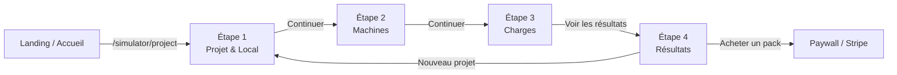
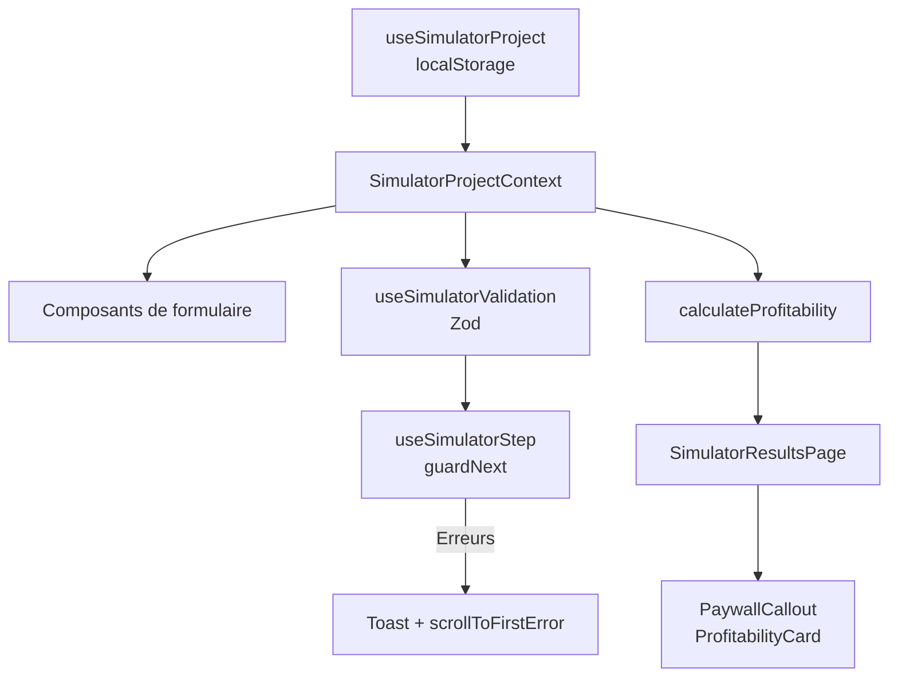

# Onboarding — Nouveau Simulateur de Rentabilité

> Document destiné aux développeurs rejoignant le projet. Il décrit ce qui a été implémenté depuis la création du nouveau simulateur de rentabilité, son architecture, ses principales conventions, et les points d'attention pour y contribuer sans casser les parcours existants.

---

## 1. Contexte et périmètre

### 1.1 Pourquoi un nouveau simulateur ?

L'application Lavcom Performances dispose de deux parcours simulateur historiques :

- `/simulateur` — simulateur **public gratuit** de qualification, avec capture email.
- `/simulation` — simulateur **payant intégré au SaaS**, avec authentification, packs Stripe et persistance base de données.

Le **nouveau simulateur** (`/simulator/*`) est une refonte du parcours payant. Il a pour objectif à terme de **remplacer les deux anciens simulateurs** par une expérience plus moderne, unifiée et plus simple à maintenir. L'ancien code est conservé le temps du développement du nouveau pour ne pas impacter les utilisateurs en production.

> **Attention** : une fois le nouveau simulateur livré, il faudra prévoir une phase de nettoyage pour supprimer les composants, pages, hooks et routes obsolètes (`/simulateur`, `/simulation`) et corriger les liens de l'application pour ne garder que le nouveau simulateur, sans casser le reste de l'application.

### 1.2 Périmètre actuel du document

| Parcours | URL | Statut |
|---|---|---|
| Nouveau simulateur visiteur | `/simulator/*` | En développement, fonctionnel sans authentification, localStorage uniquement. |
| Dashboard porteur de projet | `/dashboard-simulator/*` | **Prototype brouillon** généré par l'IA Lovable à partir des maquettes Figma. Données mockées, non fonctionnel. Voir section 8 et `docs/simulateur-v2-roadmap.md`. |
| Ancien simulateur public | `/simulateur` | Conservé en production, non documenté ici. Voir `docs/simulateur-rentabilite.md`. |
| Ancien simulateur SaaS | `/simulation` | Conservé en production, non documenté ici. Voir `docs/simulateur-architecture.md`. |

---

## 2. Cartographie des routes

Les routes sont définies dans `src/App.tsx`. Deux groupes distincts sont déclarés :

### 2.1 Simulateur visiteur

```
/simulator              → redirection vers /simulator/project
/simulator/project      → Étape 1 : identité du projet + contraintes du local
/simulator/machines     → Étape 2 : configuration des machines
/simulator/charges      → Étape 3 : charges fixes et variables
/simulator/results      → Étape 4 : résultats, paywall et CTA d'achat
```

Layout : `src/components/layout/SimulatorLayout.tsx`. Il fournit l'en-tête, le stepper et le `SimulatorProjectProvider` qui enveloppe l'ensemble des pages simulateur.

### 2.2 Dashboard porteur de projet

```
/dashboard-simulator                                    → Vue d'ensemble
/dashboard-simulator/projects                           → Liste des projets
/dashboard-simulator/projects/comparator                → Comparaison de projets
/dashboard-simulator/projects/:projectId                → Détail d'un projet
/dashboard-simulator/projects/:projectId/scenarios      → Scénarios d'un projet
/dashboard-simulator/projects/:projectId/scenarios/:id  → Détail d'un scénario
/dashboard-simulator/projects/:projectId/scenario-comparator
/dashboard-simulator/reports
/dashboard-simulator/purchases
/dashboard-simulator/account
```

Layout : `src/components/dashboard-simulator/layout/DashboardLayout.tsx`. Il est protégé par `DashboardRouteGuard` et utilise une sidebar dédiée (`AppSidebar`), indépendante de l'application opérateur principale.

> **Statut** : ces routes constituent un **prototype visuel**, pas une fonctionnalité livrable. Voir la section 8 pour le détail et `docs/simulateur-v2-roadmap.md` pour les chantiers restants.

---

## 3. Architecture applicative

### 3.1 Vue d'ensemble du simulateur

```text
src/
├── pages/simulator/
│   ├── SimulatorProjectPage.tsx       # Étape 1 (onglets Projet / Local)
│   ├── SimulatorMachinesPage.tsx      # Étape 2
│   ├── SimulatorChargesPage.tsx       # Étape 3
│   └── SimulatorResultsPage.tsx       # Étape 4
│
├── components/simulator/
│   ├── layout/
│   │   ├── SimulatorLayout.tsx        # Layout racine (déplacé dans src/components/layout/)
│   │   ├── SimulatorStepper.tsx       # Barre de progression des étapes
│   │   ├── SimulatorFooterNav.tsx     # Boutons Précédent / Continuer
│   │   └── SimulatorPageHeader.tsx    # Titre, description, bouton Reset
│   ├── project/
│   │   ├── ProjectTabs.tsx            # Onglets Projet / Local
│   │   ├── FormField.tsx              # Wrapper de champ de formulaire
│   │   ├── AddressAutocomplete.tsx    # Autocomplétion d'adresse BAN / Nominatim
│   │   ├── SurfaceCard.tsx            # Carte de saisie de la surface
│   │   ├── OpeningHoursCard.tsx     # Carte des horaires d'ouverture
│   │   ├── LocationCard.tsx           # Carte d'identification du lieu
│   │   ├── ProjectIdentityCard.tsx    # Carte d'identité du projet
│   │   ├── LocalConstraintsForm.tsx  # Formulaire des contraintes du local
│   │   ├── ProjectInfoForm.tsx        # Formulaire principal infos projet
│   │   ├── RadioCard.tsx              # Carte radio sélectionnable
│   │   └── SimulatorTabsTrigger.tsx   # Variante active verte des onglets
│   ├── machines/
│   │   ├── MachinesConfigCard.tsx     # Configuration d'une catégorie de machines
│   │   ├── MachineRevenueSummary.tsx  # Récapitulatif du CA machines
│   │   ├── MachineInfosCard.tsx       # Informations liées aux machines
│   │   └── InputFieldsInfos.tsx       # Aide à la saisie des champs
│   ├── charges/
│   │   ├── CostsCard.tsx              # Carte charges fixes ou variables
│   │   ├── CostRow.tsx                # Ligne de charge
│   │   ├── AddCostButton.tsx          # Bouton d'ajout de charge
│   │   ├── AddCostCard.tsx            # Carte d'ajout rapide
│   │   ├── TotalCostsSummary.tsx      # Récapitulatif des charges
│   │   └── SubscriptionCard.tsx       # Carte des abonnements
│   ├── results/
│   │   ├── ResultsSummaryCard.tsx     # Résumé identité du projet
│   │   ├── ResultsHeroKpis.tsx        # CA total, part lavage/séchage
│   │   ├── ProfitabilityCard.tsx      # Résultat estimé et seuil de rentabilité
│   │   ├── PaywallCallout.tsx         # Bandeau conditionnel + CTA achat
│   │   ├── GuideCallout.tsx           # Appel à action guide
│   │   └── ProjectInfos.tsx           # Ligne d'info du résumé
│   ├── ConfigHintBanner.tsx           # Bandeau d'aide contextuelle
│   ├── ProjectWarnings.tsx            # Alertes de cohérence du projet
│   └── ProgressBarWithValue.tsx       # Barre de progression avec valeur
│
├── components/ui/
│   ├── form-card.tsx                  # Carte avec ombre simulateur
│   ├── field.tsx                      # Primitives de champ shadcn
│   └── card.tsx                       # Primitives de carte shadcn
│
├── contexts/
│   ├── SimulatorProjectContext.tsx    # Contexte du projet en cours
│   └── SimulatorStepContext.tsx       # Contexte des erreurs d'étape
│
├── hooks/
│   ├── useSimulatorProject.ts         # State + persistance localStorage
│   ├── useSimulatorStep.ts            # Navigation et validation par étape
│   ├── useSimulatorValidation.ts      # Validation Zod globale et par section
│   └── useFormatters.ts               # Formatage monétaire / numérique
│
├── lib/validation/
│   └── simulatorProjectSchema.ts      # Schémas Zod du simulateur
│
├── utils/
│   ├── machineRevenueCalculations.ts  # Calculs du CA par machine
│   ├── profitabilityCalculations.ts   # Calculs de rentabilité
│   └── scrollToFirstError.ts          # Scroll vers la première erreur
│
├── types/
│   ├── simulator.types.ts             # Types du projet et des machines
│   └── simulatorFormOptions.types.ts  # Types des options de formulaire
│
├── config/
│   ├── simulatorFormOptions.ts        # Valeurs des options (pays, zones, formes...)
│   └── pricingConfig.ts / stripeConfig.ts  # Tarification et mapping Stripe
│
└── locales/
    ├── fr/paid-simulator.json           # Traductions FR
    └── en/paid-simulator.json           # Traductions EN
```

### 3.2 Dashboard porteur de projet

```text
src/
├── pages/dashboard-simulator/
│   ├── DashboardPage.tsx
│   ├── ProjectsPage.tsx
│   ├── ProjectDetailPage.tsx
│   ├── ProjectComparisonPage.tsx
│   ├── ScenariosPage.tsx
│   ├── ScenarioDetailPage.tsx
│   ├── ScenarioComparisonPage.tsx
│   ├── ReportsPage.tsx
│   ├── PurchasesPage.tsx
│   └── MyAccountPage.tsx
│
├── components/dashboard-simulator/
│   ├── layout/
│   │   ├── DashboardLayout.tsx
│   │   ├── AppSidebar.tsx
│   │   ├── AppSidebarMainNav.tsx
│   │   ├── AppSidebarProjectsNav.tsx
│   │   ├── AppSidebarPackWidget.tsx
│   │   ├── AppSidebarUserFooter.tsx
│   │   ├── WelcomeHeader.tsx
│   │   └── DashboardBreadcrumb.tsx
│   ├── overview/
│   │   ├── PackSummaryCard.tsx
│   │   ├── ProjectsStatsCard.tsx
│   │   ├── ProjectsPreviewList.tsx
│   │   ├── RecentActivityCard.tsx
│   │   └── SuggestionsCard.tsx
│   ├── projects/
│   │   ├── ProjectCard.tsx
│   │   ├── ProjectsGrid.tsx
│   │   ├── ProjectsToolbar.tsx
│   │   ├── ProjectsEmptyState.tsx
│   │   ├── ProjectCompareBar.tsx
│   │   └── PackExpiryBanner.tsx
│   ├── scenarios/
│   │   ├── ScenarioCard.tsx
│   │   ├── ScenariosGrid.tsx
│   │   ├── ScenariosToolbar.tsx
│   │   ├── ScenariosEmptyState.tsx
│   │   ├── ScenarioReferenceCard.tsx
│   │   └── ProjectHeaderSummary.tsx
│   ├── comparison/
│   │   ├── ComparisonDeltaCard.tsx
│   │   ├── ComparisonRadarCard.tsx
│   │   ├── ComparisonRoiCard.tsx
│   │   ├── ComparisonSideCard.tsx
│   │   └── ComparisonSynthesisCard.tsx
│   └── shared/
│       ├── KpiTile.tsx
│       ├── DataTable.tsx
│       ├── DeltaPill.tsx
│       ├── StatusBadge.tsx
│       └── format.ts
│
├── hooks/dashboard-simulator/
│   ├── use-dashboard-pack.ts
│   ├── use-dashboard-projects.ts
│   ├── use-dashboard-project.ts
│   ├── use-dashboard-scenarios.ts
│   ├── use-dashboard-reports.ts
│   ├── use-dashboard-invoices.ts
│   └── use-mock-query.ts
│
├── mocks/dashboard-simulator/
│   ├── mock-user.ts
│   ├── mock-projects.ts
│   ├── mock-scenarios.ts
│   ├── mock-reports.ts
│   ├── mock-invoices.ts
│   └── mock-activity.ts
│
├── constants/dashboard-simulator/
│   ├── common.strings.ts
│   ├── projects.strings.ts
│   ├── scenarios.strings.ts
│   ├── comparison.strings.ts
│   ├── reports.strings.ts
│   ├── purchases.strings.ts
│   └── account.strings.ts
│
└── types/dashboard-simulator.ts
```

---

## 4. Gestion d'état

### 4.1 Projet en cours (`SimulatorProjectContext`)

Le projet est stocké dans le contexte `SimulatorProjectContext` (`src/contexts/SimulatorProjectContext.tsx`), fourni par le hook `useSimulatorProject` (`src/hooks/useSimulatorProject.ts`).

- **Valeurs par défaut** : `defaultSimulationProject`, avec des valeurs pré-remplies (exemple : petite laverie standard avec 2 lave-linges 7 kg, 2 sèche-linges 14 kg, loyer 1 200 €, etc.).
- **Persistance** : le projet est synchronisé dans `localStorage` sous la clé `simulationProject`.
- **Hydratation** : au chargement, si une valeur existe dans `localStorage`, elle est fusionnée avec les valeurs par défaut. Cela permet de reprendre une simulation après fermeture de l'onglet.
- **Recalcul automatique** : à chaque modification des machines, le hook recalcule `washingRevenue`, `dryingRevenue` et `totalRevenue` via `calculateRevenueBreakdown`.
- **Reset** : `resetProject()` remet les valeurs par défaut et supprime l'entrée `localStorage`. Le bouton Reset dans `SimulatorPageHeader` ouvre une modale de confirmation puis redirige vers `/simulator/project`.

### 4.2 Navigation par étape (`useSimulatorStep`)

`useSimulatorStep` (`src/hooks/useSimulatorStep.ts`) gère la validation avant passage à l'étape suivante.

- Il accepte une liste de sections à valider : `projectInfo`, `localConstraints`, `washers`, `dryers`, `charges`.
- Lors du clic sur **Continuer** : `guardNext()` vérifie chaque section. Si une section est invalide, un toaster affiche le nombre total d'erreurs, puis la page défile automatiquement vers la première erreur visible (`scrollToFirstError`).
- Pour la page projet, l'option `onInvalid` bascule l'onglet actif vers "project" ou "local" selon la section en erreur.

### 4.3 Erreurs d'étape (`SimulatorStepContext`)

`SimulatorStepContext` (`src/contexts/SimulatorStepContext.tsx`) transmet aux composants descendants :

- `fieldError(name)` : message d'erreur d'un champ.
- `sections` : état de validation par section.
- `errors` : erreurs complètes.
- `attempted` : indique si l'utilisateur a déjà tenté de continuer (pour afficher les erreurs).

---

## 5. Validation des formulaires

### 5.1 Schéma Zod

La validation est centralisée dans `src/lib/validation/simulatorProjectSchema.ts`.

Les schémas sont découpés par domaine :

- `projectInfoSchema` : nom du projet, scénario, pays, adresse, ville, code postal, zone, horaires, jours d'ouverture.
- `localConstraintsSchema` : surface, forme du local, obstacles, largeur de porte, façade modifiable, contraintes techniques.
- `machinesSchema` / `washersSchema` / `dryersSchema` : configuration des machines. Exige au moins un lave-linge et un sèche-linge dans le parc global.
- `chargesSchema` / `fixedCostsSchema` / `variableCostsSchema` : charges fixes et variables. La somme des pourcentages de charges variables ne peut pas dépasser 100 %.
- `revenuesSchema` : recettes calculées automatiquement.

Le schéma global `simulatorProjectSchema` est l'union de tous ces schémas.

### 5.2 Comptage des erreurs

`useSimulatorValidation` (`src/hooks/useSimulatorValidation.ts`) valide le projet en mémoire :

- Validation globale via `simulatorProjectSchema.safeParse(project)`.
- Validation par section via `sectionSchemas[section].safeParse(...)`.
- Le comptage d'erreurs par section s'appuie sur les chemins uniques des issues Zod (`issue.path.join(".")`), ce qui permet de compter correctement chaque champ invalide dans les tableaux (machines, charges), et pas seulement une erreur par section.

### 5.3 Scroll automatique vers la première erreur

`scrollToFirstError` (`src/utils/scrollToFirstError.ts`) :

- Sélectionne les éléments `[data-slot="field-error"]`.
- Filtre le premier visible.
- Effectue un défilement fluide (`smooth` par défaut, `auto` si `prefers-reduced-motion: reduce`).
- Met le focus sur le champ associé (`input`, `select`, `textarea`, `[role="combobox"]`).

Il est appelé dans `useSimulatorStep.guardNext()` via un double `requestAnimationFrame` pour attendre la mise à jour du DOM après l'affichage des erreurs.

### 5.4 Messages d'erreur i18n

Les messages de validation Zod sont dynamiques et utilisent la fonction `tv(key)` qui appelle `i18n.t(key, { ns: "paid-simulator" })`. Les clés se trouvent dans `src/locales/fr/paid-simulator.json` et `src/locales/en/paid-simulator.json` sous le préfixe `validation.*`.

---

## 6. Moteur de calcul

### 6.1 CA par machine (`machineRevenueCalculations.ts`)

```ts
machineMonthlyRevenue = count × cyclesPerDay × price × 30
```

Le CA est calculé sur la base de **30 jours par mois**.

- `calculateCategoryRevenue(machines, "washer")` : total du CA lavage.
- `calculateCategoryRevenue(machines, "dryer")` : total du CA séchage.
- `calculateRevenueBreakdown(machines)` : renvoie `washingRevenue`, `dryingRevenue`, `totalRevenue`.

Les helpers `addMachine`, `removeMachine`, `updateMachineList` permettent de manipuler le tableau de machines en conservant l'immutabilité.

### 6.2 Rentabilité (`profitabilityCalculations.ts`)

```text
monthlyRevenue      = totalRevenue du projet (ou recalculé depuis les machines)
totalCyclesMonth    = Σ (count × cyclesPerDay × 30)
avgRevenuePerCycle  = monthlyRevenue / totalCyclesMonth
fixedCostsTotal     = Σ fixedCosts.amount
variableCostsPercent = Σ variableCosts.percent
variableCostsTotal  = monthlyRevenue × variableCostsPercent / 100
breakEvenRevenueMonthly = fixedCostsTotal / (1 − variableCostsPercent / 100)  [null si ≥ 100%]
breakEvenCyclesPerDay   = breakEvenRevenueMonthly / avgRevenuePerCycle / 30  [null si impossible]
estimatedProfitMonth  = monthlyRevenue − variableCostsTotal − fixedCostsTotal
isProfitable          = estimatedProfitMonth > 0
```

Toutes les valeurs sont en **euros** (TTC côté UI, HT dans les exports financiers futurs).

### 6.3 Affichage des résultats

La page `SimulatorResultsPage.tsx` compose trois cartes principales :

| Composant | Rôle |
|---|---|
| `ResultsSummaryCard` | Résumé identitaire du projet (ville, surface, nombre de machines). |
| `ResultsHeroKpis` | CA total mensuel, part lavage/séchage, barre de progression. |
| `ProfitabilityCard` | Résultat estimé mensuel, seuil de rentabilité, cycles/jour nécessaires. |
| `PaywallCallout` | Message conditionnel (rentable / non rentable) + CTA d'achat. |
| `ProjectWarnings` | Alertes de cohérence (surface insuffisante, etc.). |
| `GuideCallout` | Appel à action vers un guide. |

---

## 7. Page Résultats et paywall

### 7.1 État du simulateur (`IS_SIMULATOR_PACK_ACTIVE`)

Actuellement, un drapeau constant `IS_SIMULATOR_PACK_ACTIVE = false` est défini dans les composants de résultats (`PaywallCallout.tsx`, `ProfitabilityCard.tsx`). Il représente l'état "visiteur non connecté sans pack payant".

Quand le dashboard sera opérationnel et que l'authentification sera branchée, ce drapeau devra être remplacé par :

- un contexte d'accès au simulateur (front-end), ou mieux,
- une vérification côté serveur (edge function) pour éviter qu'un utilisateur ne puisse lire les vrais chiffres en inspectant le code source.

### 7.2 Masquage des chiffres (`MaskedValue`)

Tant que le pack n'est pas actif, les chiffres sensibles sont affichés mais **floutés** avec `blur-[4px]`, `select-none` et `aria-hidden="true"`. Le composant `MaskedValue` conserve la mise en page et la structure du DOM, mais empêche la lecture visuelle et l'accessibilité des valeurs réelles.

Dans `PaywallCallout`, le message est conditionnel :

- **Rentable** : titre vert, description avec les montants floutés, CTA achat.
- **Non rentable** : titre rouge, description explicative avec conseils, CTA achat.

Dans `ProfitabilityCard`, les valeurs de résultat estimé, seuil de rentabilité et cycles/jour sont affichées réelles si le pack est actif, sinon floutées avec une valeur factice.

---

## 8. Dashboard simulateur

> **Avertissement — prototype brouillon.** Le dashboard `/dashboard-simulator/*` **n'est pas encore fonctionnel**. Il s'agit d'un prototype généré par l'IA Lovable à partir des maquettes Figma, dont le seul objectif est de donner un **aperçu (preview) visuel** de ce que sera le dashboard définitif. Le code doit être considéré comme jetable ou fortement remaniable : ne pas s'appuyer dessus comme référence d'architecture, et ne pas le livrer en production en l'état.

### 8.1 État actuel

Ce qui existe : les écrans, la navigation, la sidebar et les primitives d'affichage. Les données proviennent de `src/mocks/dashboard-simulator/*` et sont consommées via les hooks `use-dashboard-*` (`src/hooks/dashboard-simulator/*`), qui simulent un appel réseau avec latence.

Ce qui n'existe pas encore :

| Manque | Détail |
|---|---|
| Données réelles | Aucune connexion à la base de données ; tout est mocké. |
| Persistance | Les projets et scénarios ne sont ni créés, ni enregistrés, ni supprimés réellement. |
| Authentification | Le guard de route est un placeholder ; aucun contrôle de session ni de pack. |
| i18n | Les libellés sont dans `src/constants/dashboard-simulator/*.strings.ts`, hors du système i18n FR/EN. |
| Thème sombre | Non traité, certaines couleurs ne sont pas encore des tokens sémantiques. |
| Tests | Aucun plan de test ni test automatisé. |

**Travail restant** : la liste complète et priorisée des chantiers du dashboard (branchement des données, authentification et packs, i18n, thème, tests, nettoyage du code généré) est détaillée dans le document complémentaire **`docs/simulateur-v2-roadmap.md`**. Ce document d'onboarding décrit *ce qui existe* ; la roadmap décrit *ce qu'il reste à faire*. Les deux se lisent ensemble.


### 8.2 Layout et navigation

- `DashboardLayout.tsx` : layout racine avec une sidebar shadcn et un en-tête fixe.
- `AppSidebar.tsx` : sidebar dédiée, avec une navigation principale (Vue d'ensemble, Projets, Achats, Rapports) et un widget de pack.
- `WelcomeHeader.tsx` : en-tête de page avec titre, sous-titre et actions.

### 8.3 Primitives partagées

- `KpiTile` : carte KPI avec label, valeur, hint et ton (default/positive/negative).
- `DataTable` : tableau de données réutilisable.
- `DeltaPill` : pastille de comparaison (ex : +12 %, -5 %).
- `StatusBadge` : badge de statut.
- `format.ts` : utilitaire `fillTemplate` pour interpoler des chaînes avec des variables.

### 8.4 Points de branchement pour les vraies données

Pour passer à de vraies données, il faudra :

1. Remplacer les mocks par des appels Supabase dans les hooks `use-dashboard-*`.
2. Relier les projets du dashboard au `SimulatorProjectContext` lorsqu'un utilisateur clique sur "Nouveau projet" ou "Éditer".
3. Persister les projets/scénarios en base de données et respecter les limites du pack (`max_projects`, `access_expires_at`).
4. Adapter `PackSummaryCard` pour lire le vrai pack actif depuis `profiles`.

---

## 9. Design system et conventions UI

### 9.1 Tokens sémantiques

Les couleurs ne sont jamais codées en dur. Le projet utilise les tokens shadcn/Tailwind définis dans `tailwind.config.ts` et `src/index.css` :

- `bg-primary`, `text-primary-foreground` pour les actions principales.
- `text-foreground`, `text-muted-foreground`, `bg-muted`, `bg-card` pour le fond et le texte.
- `text-destructive`, `bg-destructive` pour les erreurs.
- Tokens Lavcom spécifiques : `lavcom-green`, `lavcom-green-accent`, `lavcom-green-spring`, `lavcom-orange`, etc.

### 9.2 Composants de carte

- `FormCard` (`src/components/ui/form-card.tsx`) : variante de `Card` avec l'ombre `shadow-form` (`1px 2px 2px 0px rgba(0,0,0,0.1)`). C'est la brique de base des cartes de formulaire simulateur.
- Les cartes de résultats et KPI utilisent également `shadow-form` ou `shadow-profitability`.

### 9.3 Champs de formulaire

`FormField` (`src/components/simulator/project/FormField.tsx`) est un wrapper autour des primitives `Field`, `FieldLabel`, `FieldDescription`, `FieldError` de shadcn (`src/components/ui/field.tsx`). Il permet de :

- afficher un label, une icône, un indicateur requis,
- afficher un message d'erreur,
- afficher un hint/description,
- injecter tout composant `children` (Input, Select, etc.) comme contrôle du champ.

### 9.4 Onglets personnalisés

`SimulatorTabsTrigger` (`src/components/simulator/project/SimulatorTabsTrigger.tsx`) est une variante de `TabsTrigger` avec :

- fond vert (`bg-primary`) à l'état actif (`data-[state=active]:bg-primary`),
- texte sombre à l'état actif (`data-[state=active]:text-foreground`).

### 9.5 Responsive

Les pages simulateur utilisent des grilles flexibles (`flex`, `grid`) avec des largeurs relatives (`w-3/5`, `w-2/5`). Le layout global est limité à `max-w-5xl` et reste lisible sur mobile. Le dashboard utilise la sidebar shadcn responsive avec `SidebarProvider`.

---

## 10. Internationalisation (i18n)

### 10.1 Namespace `paid-simulator`

Les traductions du nouveau simulateur sont dans le namespace `paid-simulator` :

- `src/locales/fr/paid-simulator.json`
- `src/locales/en/paid-simulator.json`

Ils sont enregistrés dans `src/lib/i18n-config.ts`.

### 10.2 Conventions de nommage

Les clés sont organisées par domaine :

- `project.*` : page Projet / Local.
- `machines.*` : page Machines.
- `charges.*` : page Charges.
- `results.*` : page Résultats.
- `validation.*` : messages d'erreur Zod.
- `common.*` : textes transversaux (boutons, titres de dialogue, etc.).
- `errors.*` : messages d'erreur globaux.

### 10.3 Règle "aucune chaîne en dur"

Tout texte affiché dans le nouveau simulateur doit provenir du namespace `paid-simulator`. L'utilisation de `useTranslation("paid-simulator")` est obligatoire. Pour l'interpolation de composants React, on utilise le composant `Trans` de `react-i18next`.

---

## 11. Diagrammes

### 11.1 Flux utilisateur des 4 étapes



### 11.2 Flux de données (contexte → validation → calcul → affichage)



### 11.3 Arbre des routes

```text
App
├── /simulator
│   └── SimulatorLayout
│       ├── /project       → SimulatorProjectPage
│       ├── /machines      → SimulatorMachinesPage
│       ├── /charges       → SimulatorChargesPage
│       └── /results       → SimulatorResultsPage
│
└── /dashboard-simulator
    └── DashboardRouteGuard
        └── DashboardSimulatorLayout
            ├── /                           → DashboardPage
            ├── /projects                   → ProjectsPage
            ├── /projects/comparator        → ProjectComparisonPage
            ├── /projects/:projectId        → ProjectDetailPage
            ├── /projects/:projectId/scenarios   → ScenariosPage
            ├── /projects/:projectId/scenarios/:id → ScenarioDetailPage
            ├── /projects/:projectId/scenario-comparator → ScenarioComparisonPage
            ├── /reports                    → ReportsPage
            ├── /purchases                  → PurchasesPage
            └── /account                  → MyAccountPage
```

---

## 12. Démarrer en local

### 12.1 Outils requis

| Outil | Version / remarque |
|---|---|
| Node.js | LTS (≥ 20), installé de préférence via [nvm](https://github.com/nvm-sh/nvm) |
| npm | Fourni avec Node. `bun` est également utilisé pour certains scripts (`bunx tsgo`) |
| Git | Accès en lecture/écriture au dépôt GitHub du projet |
| VS Code | Extensions recommandées : ESLint, Prettier, Tailwind CSS IntelliSense, TypeScript |
| Compte Lovable | Accès à l'espace projet (preview, backend, secrets) — à demander au responsable projet |

### 12.2 Procédure d'installation

```bash
# 1. Cloner le dépôt
git clone <URL_DU_DEPOT>
cd <NOM_DU_PROJET>

# 2. Se placer sur la branche de développement
git checkout develop

# 3. Installer les dépendances
npm install

# 4. Créer le fichier d'environnement local
cp .env.example .env
# puis renseigner les variables VITE_* (voir section 13)

# 5. Lancer le serveur de développement
npm run dev
```

L'application est alors disponible sur `http://localhost:8080` (port défini dans `vite.config.ts`).

### 12.3 Commandes utiles

```bash
npm run dev        # serveur de développement Vite
npm run build      # build de production
npm run lint       # ESLint
bunx tsgo --noEmit # typecheck TypeScript (rapide)
npm audit          # audit de sécurité des dépendances
```

### 12.4 Workflow Git

- La branche synchronisée avec Lovable est `develop`.
- Toute contribution passe par une branche `feature/*` ou `fix/*` puis une Pull Request vers `develop`.
- La mise en production se fait par promotion de `develop` vers `main` (workflow GitHub Actions).
- Les conventions détaillées sont dans `.github/` (CI, CODEOWNERS, protection de branches).

---

## 13. Variables d'environnement

### 13.1 Deux régimes distincts

| Type | Préfixe | Lu par | Où le configurer | Secret ? |
|---|---|---|---|---|
| Variables front | `VITE_*` | Le navigateur, injectées au build par Vite | Fichier `.env` à la racine | **Non** — tout ce qui est préfixé `VITE_` finit dans le bundle public |
| Secrets backend | sans préfixe | Les Edge Functions via `Deno.env.get()` | Interface Lovable Cloud (Secrets) | **Oui** — jamais dans `.env`, jamais côté client |

La liste complète, commentée et catégorisée, se trouve dans **`.env.example`** à la racine du dépôt. C'est la source de vérité : toute nouvelle variable doit y être ajoutée (avec une valeur vide et un commentaire), jamais avec sa vraie valeur.

### 13.2 Variables nécessaires en local

| Variable | Rôle | Où trouver la valeur |
|---|---|---|
| `VITE_SUPABASE_URL` | URL du projet backend | Espace Lovable du projet / responsable projet |
| `VITE_SUPABASE_PUBLISHABLE_KEY` | Clé publique (anon) du backend, protégée par les politiques RLS | Idem |
| `VITE_SUPABASE_PROJECT_ID` | Identifiant projet, utilisé par l'outillage CLI | Idem |
| `VITE_STRIPE_MODE` | `test` ou `live` | `test` en développement |
| `VITE_STRIPE_PUBLISHABLE_KEY` | Clé publique Stripe | Tableau de bord Stripe (mode test) |
| `VITE_DEV_MODE` | Active des logs et helpers de dev | `true` en local |

Le parcours `/simulator/*` fonctionne sans backend (état en `localStorage`), mais le reste de l'application nécessite les variables backend pour démarrer correctement.

### 13.3 Règles à respecter

- **Ne jamais committer `.env`** — il est ignoré par Git ; seul `.env.example` est versionné.
- **Ne jamais préfixer un secret par `VITE_`** : clé de service, clé secrète Stripe, clés API tierces restent côté Edge Functions.
- Les secrets backend (Resend, Stripe, cron, etc.) se configurent dans **Lovable Cloud → Secrets**, pas dans un fichier local.
- Après modification de `.env`, **redémarrer le serveur de développement** : Vite ne recharge pas les variables à chaud.

### 13.4 Symptômes d'une configuration manquante

- Page blanche au démarrage ou erreurs réseau vers une URL `undefined` → variables `VITE_SUPABASE_*` absentes ou vides.
- Erreurs d'authentification systématiques → clé publique incorrecte ou pointant vers un autre environnement.
- Checkout Stripe qui échoue → `VITE_STRIPE_MODE` / `VITE_STRIPE_PUBLISHABLE_KEY` incohérents avec la clé secrète configurée côté backend.

---

## 14. De la maquette Figma au composant React

Le nouveau simulateur et le prototype de dashboard ont été produits à partir de maquettes Figma validées, selon un workflow en quatre étapes. Ce workflow est la référence pour toute nouvelle page ou tout nouveau composant issu du design.

### 14.1 Étape 1 — Export Figma → HTML + Tailwind

Utiliser l'outil [**figma.to.code** de divRIOTS](https://divriots.com/figma.to.code) : à partir de la maquette Figma, il génère une transcription en **HTML + classes Tailwind CSS**.

Cet export est un point de départ, pas un résultat final : la structure est souvent verbeuse, les valeurs sont en dur et la sémantique est absente.

### 14.2 Étape 2 — Relecture et correction du HTML

Relire intégralement le HTML généré et corriger les écarts avec la maquette validée :

- espacements, tailles de police, hauteurs de ligne, rayons et ombres ;
- états manquants (hover, focus, actif, désactivé, erreur) ;
- structure trop imbriquée à simplifier ;
- ordre et hiérarchie des titres.

L'objectif est d'obtenir un HTML statique **le plus fidèle possible** à la maquette avant toute conversion en React.

### 14.3 Étape 3 — Génération des composants React par Lovable AI

Fournir le HTML corrigé à Lovable AI en demandant explicitement des composants React **conformes à l'architecture de l'application** :

- composants fonctionnels TypeScript dans le bon dossier (`src/components/simulator/*`, `src/components/dashboard-simulator/*`) ;
- réutilisation des primitives existantes (`FormCard`, `FormField` / `Field`, `SimulatorTabsTrigger`, primitives shadcn) ;
- **tokens sémantiques uniquement** — aucune couleur en dur (`text-white`, `bg-[#...]`) ;
- textes passés par i18n (`useTranslation("paid-simulator")`), aucune chaîne en dur ;
- découpage en composants petits et ciblés.

### 14.4 Étape 4 — Revue et ajustements

Relire le code généré et corriger jusqu'à obtenir la fidélité visuelle attendue. Checklist de conformité :

- [ ] Aucune couleur, ombre ou gradient codé en dur ; tout passe par les tokens de `src/index.css` / `tailwind.config.ts`.
- [ ] Aucune chaîne de caractères en dur ; clés ajoutées en FR **et** EN.
- [ ] Composants découpés, pas de fichier monolithique.
- [ ] Responsive vérifié (mobile 320 px, tablette, desktop).
- [ ] États interactifs conformes à la maquette.
- [ ] Thème clair et thème sombre vérifiés.
- [ ] `bunx tsgo --noEmit` vert.

### 14.5 Alternative : MCP Figma en local

Il existe une intégration Figma en lecture directe via l'application **Lovable Desktop** (Figma Desktop en mode Dev, serveur MCP local activé, puis connexion dans Lovable → Settings → Connectors). Elle est **en lecture seule** : elle ne réécrit jamais dans Figma. Elle peut remplacer l'étape 1 lorsqu'un accès live à la maquette est nécessaire ; à défaut, des captures d'écran suffisent.

---

## 15. Documents projet (Google Drive)

Ressources complémentaires hébergées sur le Google Drive du projet. L'accès se demande au responsable projet.

| Document | Contenu | Lien |
|---|---|---|
| Maquettes Figma | Designs validés du simulateur et du dashboard | _(lien à ajouter)_ |
| Spécifications fonctionnelles | Règles métier, parcours, cas limites | _(lien à ajouter)_ |
| Cahier de recette | Scénarios de validation avant livraison | _(lien à ajouter)_ |
| Comptes rendus de réunion | Historique des décisions produit | _(lien à ajouter)_ |
| Charte graphique / ressources de marque | Logos, couleurs, typographies Lavcom | _(lien à ajouter)_ |
| Roadmap produit | Jalons et priorisation côté métier | _(lien à ajouter)_ |

> Les liens ci-dessus sont à compléter manuellement. Merci de maintenir ce tableau à jour lors de l'ajout d'un nouveau document partagé.

---

## 16. Guide du contributeur

### 16.1 Ajouter un champ dans le simulateur

1. **Type** : ajouter la propriété dans `src/types/simulator.types.ts` (`SimulationProject`).
2. **Valeur par défaut** : l'ajouter dans `defaultSimulationProject` (`src/hooks/useSimulatorProject.ts`).
3. **Option de formulaire** : si le champ est une option, l'ajouter dans `src/config/simulatorFormOptions.ts` et son type dans `src/types/simulatorFormOptions.types.ts`.
4. **Schéma Zod** : ajouter la règle dans `src/lib/validation/simulatorProjectSchema.ts` et les clés i18n dans `validation.*`.
5. **Composant** : intégrer le champ dans la carte/section appropriée (`project/`, `machines/`, `charges/`) via `FormField`.
6. **Traductions** : ajouter les clés FR dans `src/locales/fr/paid-simulator.json` et EN dans `src/locales/en/paid-simulator.json`.
7. **Vérification** : lancer `bunx tsgo --noEmit` pour le typecheck.

### 16.2 Ajouter une étape

1. Ajouter la route dans `src/App.tsx` sous `SimulatorLayout`.
2. Créer la page dans `src/pages/simulator/`.
3. Ajouter l'étape dans `steps` de `SimulatorStepper.tsx`.
4. Mettre à jour `STEP_BY_PATH` dans `SimulatorLayout.tsx`.
5. Utiliser `useSimulatorStep` avec la ou les sections Zod concernées.

### 16.3 Ajouter une carte de résultats

1. Créer le composant dans `src/components/simulator/results/`.
2. Lire le projet via `useSimulatorProjectContext`.
3. Utiliser `useTranslation("paid-simulator")` pour les textes.
4. Intégrer la carte dans `SimulatorResultsPage.tsx`.
5. Ajouter les clés i18n FR/EN.

### 16.4 Commandes de vérification

```bash
# Typecheck
bunx tsgo --noEmit

# Audit de sécurité des dépendances
npm audit
```

> **Note utilisateur** : les vérifications de vulnérabilités des dépendances doivent se faire avec `npm audit`, pas via un outil de sécurité abstrait.

### 16.5 Pièges connus

- **i18n Zod** : les messages de validation sont générés au moment de l'import du schéma. Si `i18n` n'est pas encore initialisé, la langue par défaut est utilisée. Cela ne pose pas de problème en pratique car le schéma est appelé après le montage de l'application.
- **LocalStorage** : le projet est stocké sous forme JSON. Si la structure évolue, penser à gérer la compatibilité ascendante ou à incrémenter/versionner la clé de stockage.
- **Paywall client** : `IS_SIMULATOR_PACK_ACTIVE` est un drapeau statique. Il ne doit pas être considéré comme une mesure de sécurité : remplacer par une vérification serveur avant toute livraison en production.
- **Dashboard isolé** : le dashboard n'utilise pas les mêmes providers que l'application opérateur. Ne pas mélanger les contextes (`useAuth`, `useActiveLaundromat`, etc.) dans les pages dashboard-simulator sans réflexion préalable.

---

## 17. Dette technique et suite

> La liste exhaustive et priorisée des chantiers restants (simulateur **et** dashboard) est tenue à jour dans **`docs/simulateur-v2-roadmap.md`**. Les points ci-dessous en sont le résumé.

### 17.1 À court terme

- **Remplacer `IS_SIMULATOR_PACK_ACTIVE`** par un vrai contrôle d'accès (contexte ou edge function).
- **Reprendre le prototype dashboard** : le code généré depuis Figma doit être revu, découpé et branché sur de vraies données.
- **Connecter le dashboard** à la base de données Supabase (projets, scénarios, achats, rapports).
- **Gérer les packs** : lire `access_expires_at`, `max_projects`, `plan_code` depuis `profiles`.
- **Gérer l'authentification** : le dashboard est destiné aux utilisateurs connectés ; le simulateur visiteur doit rester accessible sans authentification.
- **i18n, thème sombre et plan de tests** du dashboard, aujourd'hui inexistants.

### 17.2 À moyen terme (décommissionnement)

- Supprimer l'ancien simulateur `/simulateur` et `/simulation` une fois le nouveau validé.
- Migrer les liens de l'application (landing, navigation, emails) vers `/simulator` et `/dashboard-simulator`.
- Supprimer les composants obsolètes (`src/components/simulation/*`, `src/pages/SimulationPage.tsx`, etc.) et les edge functions inutilisées.
- Mettre à jour `docs/simulateur-rentabilite.md` et `docs/simulateur-architecture.md` pour refléter le nouveau parcours unique.

### 17.3 Ressources complémentaires

- **Feuille de route / reste à faire : `docs/simulateur-v2-roadmap.md`** (document complémentaire indispensable)
- Plan de test frontend : `docs/testing/simulator-test-plan.md`
- Variables d'environnement : `.env.example`
- Architecture ancienne `/simulation` : `docs/simulateur-architecture.md`
- Documentation fonctionnelle ancienne : `docs/simulateur-rentabilite.md`

---

*Document rédigé le 7 août 2026 — à jour avec la refonte du simulateur de rentabilité Lavcom Performances.*
