# Database Tables Dependency Map

> Complete foreign-key relationship graph for all 65+ tables in the Lavcom Performances database.

---

## 1. Entity Relationship Diagram (Mermaid)

```mermaid
%%{init: {'theme': 'base'}}%%
erDiagram
    organizations ||--o{ sites : "organization_id"
    organizations ||--o| organization_privacy_settings : "organization_id"
    organizations ||--o| beta_company_overrides : "company_id"
    organizations ||--o{ beta_feedback : "company_id"
    organizations ||--o{ kpi_objectives : "company_id"
    organizations ||--o{ permission_webhooks : "organization_id"
    organizations ||--o{ privacy_consent_audit_logs : "organization_id"
    organizations ||--o{ team_invitations : "organization_id"
    organizations ||--o{ user_permissions : "organization_id"
    organizations ||--o{ ux_feedback : "company_id"

    sites ||--o{ analytics_daily : "site_id"
    sites ||--o{ analytics_kpis : "site_id"
    sites ||--o{ diagnostics_bundles : "site_id"
    sites ||--o{ export_jobs : "site_id"
    sites ||--o{ import_batches : "site_id"
    sites ||--o{ kpi_objectives : "site_id"
    sites ||--o{ operations : "site_id"
    sites ||--o| company_payment_config : "company_id"
    sites ||--o| site_analytics_state : "site_id"
    sites ||--o| site_costs : "site_id"
    sites ||--o{ site_access : "site_id"
    sites ||--o{ trust_day : "company_id"
    sites ||--o{ trust_import : "company_id"
    sites ||--o{ trust_line : "company_id"
    sites ||--o{ user_goals : "site_id"

    import_batches ||--o{ operations : "import_batch_id"
    import_batches ||--o{ trust_import : "import_id"
    import_batches ||--o{ trust_line : "import_id"

    operations ||--o| trust_line : "operation_id"

    fin_workspaces ||--o{ fin_projects : "workspace_id"
    fin_projects ||--o{ fin_hypotheses : "project_id"
    fin_projects ||--o{ fin_hypothesis_snapshots : "project_id"
    fin_projects ||--o{ fin_line_items : "project_id"
    fin_projects ||--o{ fin_forecasts : "project_id"
    fin_projects ||--o{ fin_scenarios : "project_id"
    fin_projects ||--o{ fin_exports : "project_id"

    fin_scenarios ||--o{ fin_forecasts : "scenario_id"
    fin_scenarios ||--o{ fin_line_items : "scenario_id"

    kb_sources ||--o{ kb_knowledge : "source_id"
    kb_knowledge ||--o{ kb_faq : "knowledge_id"
    kb_knowledge ||--o{ kb_knowledge_versions : "knowledge_id"
    kb_knowledge ||--o{ kb_rules : "knowledge_id"

    backup_jobs ||--o{ backup_files : "backup_job_id"
```

---

## 2. Table Groups & Foreign Keys

### 2.1 Core Business Tables

#### `organizations` (Central entity)
- **Referenced by:**
  - `sites.organization_id`
  - `organization_privacy_settings.organization_id` (1:1)
  - `beta_company_overrides.company_id` (1:1)
  - `beta_feedback.company_id`
  - `kpi_objectives.company_id`
  - `permission_webhooks.organization_id`
  - `privacy_consent_audit_logs.organization_id`
  - `team_invitations.organization_id`
  - `user_permissions.organization_id`
  - `ux_feedback.company_id`

#### `sites` (Central entity)
- **References:** `organizations.id` via `organization_id`
- **Referenced by:**
  - `analytics_daily.site_id`
  - `analytics_kpis.site_id`
  - `company_payment_config.company_id` (1:1)
  - `diagnostics_bundles.site_id`
  - `export_jobs.site_id`
  - `import_batches.site_id`
  - `kpi_objectives.site_id`
  - `operations.site_id`
  - `site_access.site_id`
  - `site_analytics_state.site_id` (1:1)
  - `site_costs.site_id` (1:1)
  - `trust_day.company_id`
  - `trust_import.company_id`
  - `trust_line.company_id`
  - `user_goals.site_id`

#### `operations`
- **References:** `sites.id`, `import_batches.id`
- **Referenced by:** `trust_line.operation_id` (1:1)

#### `import_batches`
- **References:** `sites.id`
- **Referenced by:** `operations.import_batch_id`, `trust_import.import_id`, `trust_line.import_id`

### 2.2 Analytics & KPI Tables

| Table | References | Cardinality |
|-------|-----------|-------------|
| `analytics_daily` | sites | N:1 |
| `analytics_kpis` | sites | N:1 |
| `site_analytics_state` | sites | 1:1 |
| `kpi_objectives` | organizations, sites | N:1 both |

### 2.3 Financial Module Tables

| Table | References | Cardinality |
|-------|-----------|-------------|
| `fin_workspaces` | — (owner_user_id implicit) | root |
| `fin_projects` | fin_workspaces | N:1 |
| `fin_scenarios` | fin_projects | N:1 |
| `fin_hypotheses` | fin_projects | N:1 |
| `fin_hypothesis_snapshots` | fin_projects | N:1 |
| `fin_line_items` | fin_projects, fin_scenarios | N:1 both |
| `fin_forecasts` | fin_projects, fin_scenarios | N:1 both |
| `fin_exports` | fin_projects | N:1 |

### 2.4 Trust & Data Quality Tables

| Table | References | Cardinality |
|-------|-----------|-------------|
| `trust_day` | sites | N:1 |
| `trust_import` | sites, import_batches | N:1 both |
| `trust_line` | sites, import_batches, operations | N:1, N:1, 1:1 |

### 2.5 Knowledge Base Tables

| Table | References | Cardinality |
|-------|-----------|-------------|
| `kb_sources` | — | root |
| `kb_knowledge` | kb_sources | N:1 |
| `kb_faq` | kb_knowledge | N:1 |
| `kb_knowledge_versions` | kb_knowledge | N:1 |
| `kb_rules` | kb_knowledge | N:1 |

### 2.6 Backup & Compliance Tables

| Table | References | Cardinality |
|-------|-----------|-------------|
| `backup_jobs` | — | root |
| `backup_files` | backup_jobs | N:1 |
| `compliance_reports` | — | standalone |
| `audit_log_archives` | — | standalone |

### 2.7 Auth & Security Tables (No FK)

These tables use `user_id` but do NOT have FK constraints to `auth.users`:

| Table | Purpose |
|-------|---------|
| `profiles` | Extended user profile |
| `platform_roles` | Super-admin roles |
| `user_roles` | Org-level roles |
| `subscriptions` | Billing subscriptions |
| `purchases` | One-time purchases |
| `login_logs` | Login history |
| `auth_login_events` | Login events with risk |
| `auth_login_otps` | OTP codes |
| `trusted_devices` | Trusted device list |
| `recovery_codes` | MFA recovery codes |
| `mfa_challenges` | MFA challenges |
| `notification_preferences` | Notification settings |
| `admin_login_history` | Admin login audit |
| `admin_audit_logs` | Admin actions |
| `admin_blocked_users` | Blocked users |
| `admin_trusted_ips` | Trusted IPs |
| `audit_logs` | General audit trail |
| `permission_audit_logs` | Permission changes |
| `impersonation_sessions` | Admin impersonation |

### 2.8 Standalone Tables (No FK)

| Table | Purpose |
|-------|---------|
| `contact_messages` | Contact form submissions |
| `expert_requests` | Expert consultation requests |
| `simulator_leads` | Simulator lead capture |
| `stripe_events` | Stripe webhook events |
| `stripe_invoices` | Synced Stripe invoices |
| `system_events` | System event log |
| `rate_limits` | Rate limiting state |
| `cron_logs` | Cron job execution logs |
| `cron_alert_settings` | Cron alerting config |
| `churn_alert_settings` | Churn alerting config |
| `alert_history` | Alert delivery log |
| `platform_feature_flags` | Feature flags |
| `fr_geo_regions` | French geography reference |
| `ai_usage_daily` | AI usage tracking |
| `user_chart_preferences` | Chart filter persistence |
| `paywall_bypass_allowlist` | Bypass paywall by email |
| `orphan_page_reviews` | Orphan page tracking |
| `dr_drill_history` | DR drill history |
| `dr_drill_runs` | DR drill executions |
| `diagnostics_bundles` | Diagnostic bundles |
| `file_metadata` | File metadata |

---

## 3. Central Hubs

The most connected tables acting as hubs:

| Table | Inbound FKs | Outbound FKs |
|-------|-------------|--------------|
| `sites` | 15 | 1 |
| `organizations` | 10 | 0 |
| `fin_projects` | 6 | 1 |
| `import_batches` | 3 | 1 |
| `kb_knowledge` | 3 | 1 |
| `operations` | 1 | 2 |
| `fin_scenarios` | 2 | 1 |

---

## 4. Implicit Relationships (No FK, user_id based)

All tables with `user_id` columns reference `auth.users(id)` conceptually but **do not** have foreign key constraints. This is by design — the `profiles` table acts as the public-facing user table.

Key user_id tables: `profiles`, `sites`, `operations`, `subscriptions`, `purchases`, `audit_logs`, `import_batches`, `analytics_daily`, `analytics_kpis`, `fin_workspaces`, `login_logs`, `notification_preferences`, `user_goals`, `user_chart_preferences`.
